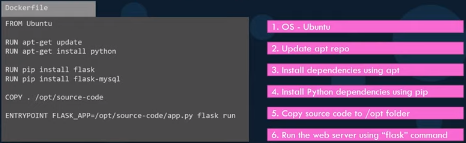
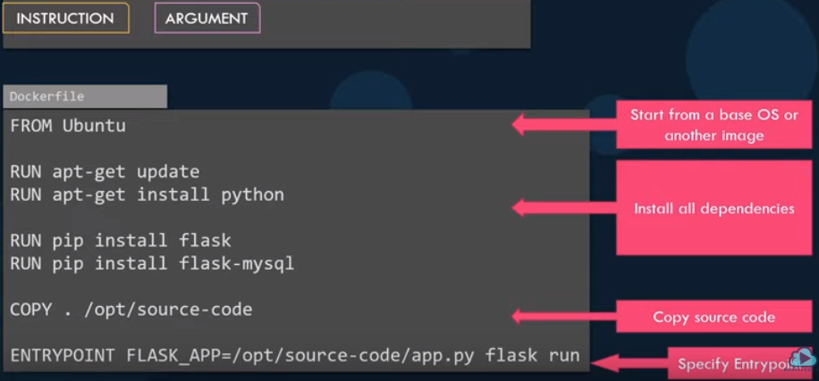

本文内容

[TOC]

# 一、Docker基础

- Docker Client 客户端
- Docker Daemon 守护进程
- Docker Image 镜像：docker镜像运行之后编程容器(docker run ...)
- Docker Container 容器
- Docker Registry 仓库: docker镜像的中央存储仓库（pull / push）

## Docker安装(ubuntu)

[`refer1: Get Docker Engine - Community for Ubuntu`](<https://docs.docker.com/install/linux/docker-ce/ubuntu/>)
[`refer2:Docker快速安装以及换镜像源`](<https://www.jianshu.com/p/34d3b4568059>)

- 方法1：

```
# 推荐ubuntu系统安装docker方式  具体参考refer1的官方文档
# 1. 如果存在旧版本docker，先按此方法卸载
sudo apt-get remove docker docker-engine docker.io containerd runc
# 2. Install using the repository
sudo apt-get update
sudo apt-get install \
    apt-transport-https \
    ca-certificates \
    curl \
    gnupg-agent \
    software-properties-common
# 3. Add Docker’s official GPG key：确认所下载软件包的合法性，需添加软件源的`GPG`密匙
# 官方：curl -fsSL https://download.docker.com/linux/ubuntu/gpg | sudo apt-key add -
curl -fsSL https://mirrors.ustc.edu.cn/docker-ce/linux/ubuntu/gpg | sudo apt-key add -	# 中科大源的密匙
# 4. 向 source.list 中添加 Docker 软件源
# 官方：第二行用 "deb [arch=amd64] https://download.docker.com/linux/ubuntu \  替换
sudo add-apt-repository \
    "deb [arch=amd64] https://mirrors.ustc.edu.cn/docker-ce/linux/ubuntu \
    $(lsb_release -cs) \
    stable"
        # 忘了下面两行代码是什么情况下执行的		
        # whereis curl		# 有则不需要案子curl, 无 则 sudo apt-get install -y curl
        # curl -SSL https://get.docker.com/ | sudo sh
# 5. 安装 Docker CE： 更新 apt 软件包缓存，并安装 docker-ce
sudo apt-get update
sudo apt-get install docker-ce
# 6. 测试 Docker 是否安装正确
docker run hello-world
```

- 方法2：

```
在测试或开发环境中 Docker 官方为了简化安装流程，提供了一套便捷的安装脚本，Ubuntu 系统上可以使用这套脚本安装：
curl -fsSL get.docker.com -o get-docker.sh
sudo sh get-docker.sh --mirror Aliyun
执行这个命令后，脚本就会自动的将一切准备工作做好，并且把 Docker CE 的 Edge 版本安装在系统中。
```

## 镜像加速

- 官方镜像加速：http://www.docker-cn.com/registry-mirror

- 国内镜像加速：

  中科大镜像：https://docker.mirrors.ustc.edu.cn
  `Azure`中国镜像： https://dockerhub.azk8s.cn
  七牛加速器：https://reg-mirror.qiniu.com
  `daocloud`镜像：https://get.daocloud.io/daotools/set_mirror

## docker换镜像源

配置方法：
	新版的 Docker 使用` /etc/docker/daemon.json（Linux）`` 或者 %programdata%\docker\config\daemon.json（Windows） `来配置` Daemon`。
	请在该配置文件中加入下列代码（没有该文件的话，请先建一个）：
	`{"registry-mirrors": ["https://docker.mirrors.ustc.edu.cn"]}`
亦即：$~ sudo vim /etc/docker/daemon.json  写入：

```
sudo vim /etc/docker/daemon.json
# 写入以下内容，然后重启docker服务即可 （中科大的源镜像）
{"registry-mirrors": ["https://docker.mirrors.ustc.edu.cn"]}
```

## 启动Docker CE

```
# 方法1安装好后貌似不需要这两步，方法2没试过
sudo systemctl enable docker
sudo systemctl start docker
```

## 建立 docker 用户组

```
# 添加用户组
sudo groupadd docker 				# 添加docker名字的用户组
sudo gpasswd -a klaus docker		 # 将klaus用户添加到 docker 用户组
sudo service docker restart			# 重启docker服务，然后注销用户即可使用非root用户
```

## 启动和关闭docker命令	

```
# docker启动命令,docker重启命令,docker关闭命令
启动        systemctl start docker
守护进程重启   sudo systemctl daemon-reload
重启docker服务   systemctl restart  docker
重启docker服务  sudo service dcker restart
关闭docker   service docker stop   
关闭docker  systemctl stop docker
```

## 日常docker命令

### 创建镜像

1、从仓库拉取创建镜像

```
# 创建镜像（从仓库拉取）
docker pull python:3.6	
# 拉取aspnetcore的sdk和runtime环境
docker pull  microsoft/dotnet:2.2-sdk
docker pull  microsoft/dotnet:2.2-aspnetcore-runtime
```

2、利用`Dockerfile`文件创建镜像

```
# 创建本地镜像(利用Dockerfile文件创建)
docker build -t <image_name>[:<image_tag>] .  
!!!  命令行最后的dot "." 一定不能少 , 表示在当前文件夹中查找dockerfile !!!
	--tag, -t: 镜像的名字及标签，通常 name:tag 或者 name 格式；可以在一次构建中为一个镜像设置多个标签。
	-f :指定要使用的Dockerfile路径
	eg.:
		docker build -t runoob/ubuntu:v1 . 
		docker build -f /path/to/a/Dockerfile .
```

### 删除镜像

```
# 删除镜像
docker rmi <image_id or tag>
# 删除虚悬镜像
docker rmi [-f] $(docker images -f "dangling=true" -q)   # [-f] 可选，强制删除
# 批量清理临时镜像文件
docker image prune -a -f  # 也可以
```

### 镜像下创建容器及容器相关操作

```
# 在镜像下创建容器（新建并启动container）：docker run 之后生成container
docker run -i:   # 以交互模式运行容器，通常与 -t 同时使用；
		  -t: 	# 为容器重新分配一个伪输入终端，通常与 -i 同时使用
		  -d: 	# 后台运行容器，并返回容器ID
		  -p: 	# （小写）指定端口映射，格式为：主机(宿主)端口:容器端口
		  -P:	# （大写）随机端口映射，容器内部端口随机映射到主机的高端口 
		  --name="nginx-lb": 为容器指定一个名称
		  --volume , -v: 绑定一个卷 -v host_dir:container_dir
docker run -d -p 2222:22 --name base csphere/centos:7.1
>>>>>>>>>>>>>>>>>>>>>>>>>>>>>>>>>>>>>>>>>>>>>>>>>>>>>>>>>>>>>>>>>>>>>>>>>>>>>>>>>>>>>>>
# 交互模式在continuumio/anaconda3镜像下创建容器(命名：ananconda3)并进入容器
docker run -it --name anaconda3 continuumio/anaconda3
# 退出后重新进入容器，并进入anaconda3环境bash环境
docker start anaconda3
docker exec -it anaconda3 /bin/bash
# 退出容器且保持后台运行： ctrl + p, q
<<<<<<<<<<<<<<<<<<<<<<<<<<<<<<<<<<<<<<<<<<<<<<<<<<<<<<<<<<<<<<<<<<<<<<<<<<<<<<<<<<<<<<<

# 重新启动一个已停止的容器
docker container start <container ID or NAMES>
# 终止运行中的容器
docker container stop <container ID or NAMES>
# 将一个运行态的容器终止，然后再重新启动
docker container restart <container ID or NAMES>

# 查看容器
docker ps [OPTIONS]
    -a :显示所有的容器，包括未运行的。
    -f :根据条件过滤显示的内容。
    --format :指定返回值的模板文件。
    -l :显示最近创建的容器。
    -n :列出最近创建的n个容器。
    --no-trunc :不截断输出。
    -q :静默模式，只显示容器编号。
    -s :显示总的文件大小。
 # 查看容器自身的信息
 docker inspect <container ID or NAMES>
 # 获取容器的输出日志信息
 docker container logs <container ID or NAMES>
    
# 进入容器，在运行的容器中执行命令  docker exec 
docker exec [OPTIONS] CONTAINER COMMAND [ARG...]
	-d :分离模式: 在后台运行
    -i :即使没有附加也保持STDIN 打开
    -t :分配一个伪终端
    eg.:
    	# 1) 在容器 mynginx 中开启一个交互模式的终端:
    	runoob@runoob:~$ docker exec -i -t  mynginx /bin/bash	
	    root@b1a0703e41e7:/#
	    # 2) 在容器 mynginx 中以交互模式执行容器内 /root/runoob.sh 脚本:
	    runoob@runoob:~$ docker exec -it mynginx /bin/sh /root/runoob.sh
		http://www.runoob.com/	
		
# 删除容器
docker rm <container_id or tag>
# 清理所有处于终止状态的容器
docker container prune
```

## 创建Dockerfile文件

[`refer: 中文官方文档--Dockerfile介绍 `](<http://www.dockerinfo.net/dockerfile%e4%bb%8b%e7%bb%8d>)

<div align=center></div>


<div align=center></div>


# 二、windows环境下 webapi部署到 虚拟机的ubuntu系统的docker中

[`refer here`](https://www.cnblogs.com/daxnet/p/5782019.html)

1) 将ASP.NET Core Web API应用程序编译成Docker Image
	首先，进入项目根目录（也就是包含有project.json文件的这个目录），使用dotnet publish命令发布应用程序。这就会把编译后的DLL连同依赖项一起，全部复制到bin/Debug/netcoreapp1.0/publish目录下。此时，使用WinSCP类似的软件，将该目录下的所有内容全部复制到Ubuntu的机器上（当然，如果是在Windows 10下使用Docker，也就不需要这个复制的步骤）。复制完成后，在Ubuntu系统中可以看到所有的这些文件.

2) 在这个包含有DockerWebAPI.dll文件的目录下，新建一个Dockerfile文件，使用vim或者nano等文本编辑器，输入以下内容（#开头的行为注释行，可以不输入）：

```
# 基于microsoft/dotnet:latest构建Docker Image
FROM microsoft/dotnet:latest
 
# 进入docker中的/usr/local/src目录
RUN cd /usr/local/src
 
# 创建DockerWebAPI目录
RUN mkdir DockerWebAPI
 
# 设置工作路径
WORKDIR /usr/local/src/DockerWebAPI
 
# 将当前文件夹下的所有文件全部复制到工作目录
COPY *.* ./
 
# 向外界暴露5000端口
EXPOSE 5000
 
# 执行dotnet xxxx.dll命令
CMD ["dotnet", "tgproApi.dll"]
```

3) 在当前目录下，创建dotnet的Doker镜像：

```
docker build -t klaus/docker-webapi .
```

4) 在3中创建的镜像下 docker run 生成容器

```
docker run -it -p 8080:5000 klaus/docker-webapi
```

- -it参数表示需要提供一个模拟的shell环境，并要求有用户交互功能，这样当我们按下Ctrl+C的时候，就可以停止我们的应用程序
- -p 8080:5000参数表示需要将Docker Container的5000端口映射到主机环境的8080端口，也就是客户端可以直接通过8080端口访问我们的应用程序
   - daxnet/docker-webapi参数指定了需要运行的Docker Image。此处采用默认的latest标签

# 三、ASP.NET Core开发-Docker部署运行

## 演示案例：demo

### demo创建和ubuntu测试

- `windows`系统下用`vs`或`dotnet`命令创建`webapi`的`demo`，创建好后，在`Program.cs`中添加`UseUrls("http://*:5000")`（ubuntu中能够使用ip访问的关键）, 代码如下：

  ```
  using System;
  using System.Collections.Generic;
  using Microsoft.AspNetCore;
  using Microsoft.AspNetCore.Hosting;
  
  namespace demoApi
  {
      public class Program
      {
          public static void Main(string[] args)
          {
              CreateWebHostBuilder(args).Build().Run();
          }
  
          public static IWebHostBuilder CreateWebHostBuilder(string[] args) =>
              WebHost.CreateDefaultBuilder(args)
                  .UseUrls("http://*:5000")
                  .UseStartup<Startup>();
      }
  }
  ```

- `cmd`到项目根目录，`dotnet restore`（可忽略），再发布`dotnet publish`, 发布的文件夹路径默认为`~\bin\Debug\netcoreapp2.2\publish`

  `dotnet restore` 是一个隐式的命令，需要还原的时候会自动执行 `dotnet restore` 命令。下面的命令执行时都会隐式调用还原。

  - `new`
  - `run`
  - `build`
  - `publish`
  - `pack`
  - `test`

- `xshell`连接虚拟机的`ubuntu`系统，使用`rz`命令将`publish` 文件夹内容复制到`Ubuntu`系统中

- 测试`ubuntu`中发布的`.dll`是否可以运行

  ```
  cd webapi/publish/		# publish的文件所在路径
  dotnet demoApi.dll 		# 启动demo
  >>> Hosting environment: Production
      Content root path: /home/klaus/webapi/publish
      Now listening on: http://[::]:5000
      Application started. Press Ctrl+C to shut down.
  curl http://192.168.1.85:5000/api/values		# 192.168.1.85为虚拟机的ip,不是windows的ip
  >>> ["value1","value2"]	# 说明接口调用正常
  ```

### ubuntu中docker镜像创建

[`refer1: `ASP.NET Core开发-Docker部署运行`](https://www.cnblogs.com/linezero/p/docker.html)
[`refer2: docker 部署 webapi 示例`](<https://blog.csdn.net/u014690615/article/details/83590412>)

- 终端进入`publish`文件夹，创建Dockerfile文件，内容如下：

  ```
  # 基于microsoft/dotnet:latest构建Docker Image
  FROM microsoft/dotnet:latest
   
  # 进入docker中的/usr/local/src目录
  RUN cd /usr/local/src
   
  # 创建DockerWebAPI目录
  RUN mkdir DockerWebAPI
   
  # 设置工作路径
  WORKDIR /usr/local/src/DockerWebAPI
   
  # 将当前文件夹下的所有文件全部复制到工作目录
  COPY *.* ./
   
  # 向外界暴露5000端口
  EXPOSE 5000
   
  # 执行dotnet xxxx.dll命令
  CMD ["dotnet", "demoApi.dll"]
  ```

- 通过`Dockerfile`文件创建镜像：在`Dockerfile`所在当前目录, 终端命令如下：

  ```
  docker build -t dockerapi/demo .    # 最后的 " . "不能忽略,且repository name must be lowercase
  ```

- 在镜像下创建容器，命名为`apidemo`, 端口映射为: `51113:5000`

  ```
  docker run -it -p 51113:5000 --name apidemo dockerapi/demo
  >>> 
  warn: Microsoft.AspNetCore.DataProtection.KeyManagement.XmlKeyManager[35]
        No XML encryptor configured. Key {86157ad5-e0ee-488a-89a5-320bf4edb7f3} may be persisted to storage in unencrypted form.
  Hosting environment: Production
  Content root path: /usr/local/src/DockerWebAPI
  Now listening on: http://[::]:5000
  Application started. Press Ctrl+C to shut down.
  ```

- 测试api 结果如下，api调用成功， 然后`ctrl+C`退出

  ```
  curl http://192.168.1.85:51113/api/values
  >>> ["value1","value2"]
  ```

- 重新开启api容器： `docker container start <container_name or tag>`

  ```
  docker container start apidome		# 开启已经停止的api容器
  >>> apidemo
  curl http://192.168.1.85:51113/api/values	# 连接接口
  >>> ["value1","value2"]
  ```

- 关闭运行状态中的api容器

  ```
  docker container stop apidemo 
  ```

  

