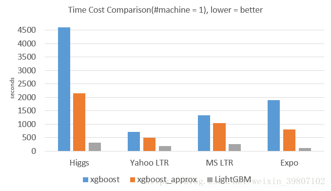

本文内容

[TOC]

## 1.  LightGBM原理

### 1.1 GBDT和 LightGBM对比

​	GBDT (Gradient Boosting Decision Tree) 是机器学习中一个长盛不衰的模型，其主要思想是利用弱分类器（决策树）迭代训练以得到最优模型，该模型具有训练效果好、不易过拟合等优点。GBDT 在工业界应用广泛，通常被用于点击率预测，搜索排序等任务。GBDT 也是各种数据挖掘竞赛的致命武器，据统计 Kaggle 上的比赛有一半以上的冠军方案都是基于 GBDT。

​	LightGBM （Light Gradient Boosting Machine）是一个实现 GBDT 算法的框架，支持高效率的并行训练，并且具有以下优点：

- 更快的训练速度
- 更低的内存消耗
- 更好的准确率
- 分布式支持，可以快速处理海量数据

​	如下图，在 Higgs 数据集上 LightGBM 比 XGBoost 快将近 10 倍，内存占用率大约为 XGBoost 的1/6，并且准确率也有提升。

### 1.2 LightGBM的动机

​	常用的机器学习算法，例如神经网络等算法，都可以以 mini-batch 的方式训练，训练数据的大小不会受到内存限制。
​	 而 **GBDT 在每一次迭代的时候，都需要遍历整个训练数据多次**。如果把整个训练数据装进内存则会限制训练数据的大小；如果不装进内存，反复地读写训练数据又会消耗非常大的时间。尤其面对工业级海量的数据，普通的 GBDT 算法是不能满足其需求的。
​	*LightGBM 提出的主要原因就是为了解决 GBDT 在海量数据遇到的问题，让 GBDT 可以更好更快地用于工业实践。*

### 1.3 Xgboost 原理

