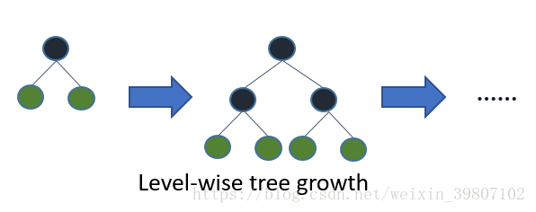

本文内容

[TOC]

[`from: LightGBM算法总结`](https://blog.csdn.net/weixin_39807102/article/details/81912566)

！！ ———————— 详细介绍参考：[<font color=limegreen>`LightGBM中文文档`</font> ](https://lightgbm.apachecn.org/#/docs/3)或 [<font color=limegreen>`LightGBM’s documentation`</font>](https://lightgbm.readthedocs.io/en/latest/index.html) ——————————！！

# 1.  LightGBM原理

## 1.1 GBDT和 LightGBM对比

​	GBDT (Gradient Boosting Decision Tree) 是机器学习中一个长盛不衰的模型，其主要思想是利用弱分类器（决策树）迭代训练以得到最优模型，该模型具有训练效果好、不易过拟合等优点。GBDT 在工业界应用广泛，通常被用于点击率预测，搜索排序等任务。GBDT 也是各种数据挖掘竞赛的致命武器，据统计 Kaggle 上的比赛有一半以上的冠军方案都是基于 GBDT。

​	`LightGBM `（<font color=coral>`Light Gradient Boosting Machine`</font>）是一个实现 GBDT 算法的框架，支持高效率的并行训练，并且具有以下优点：

- 更快的训练速度
- 更低的内存消耗
- 更好的准确率
- 分布式支持，可以快速处理海量数据

​	如下图，在 Higgs 数据集上 LightGBM 比 XGBoost 快将近 10 倍，内存占用率大约为 XGBoost 的1/6，并且准确率也有提升。

<div align=center></div>

## 1.2 LightGBM的动机

​	常用的机器学习算法，例如神经网络等算法，都可以以 mini-batch 的方式训练，训练数据的大小不会受到内存限制。
​	 而 **GBDT 在每一次迭代的时候，都需要遍历整个训练数据多次**。如果把整个训练数据装进内存则会限制训练数据的大小；如果不装进内存，反复地读写训练数据又会消耗非常大的时间。尤其面对工业级海量的数据，普通的 GBDT 算法是不能满足其需求的。
​	*LightGBM 提出的主要原因就是为了解决 GBDT 在海量数据遇到的问题，让 GBDT 可以更好更快地用于工业实践。*

## 1.3 Xgboost 原理

​	目前已有的 GBDT 工具基本都是基于**预排序**的方法（pre-sorted）的决策树算法(如 xgboost)。这种构建决策树的算法基本思想是：

- 首先，对所有特征都按照特征的数值进行预排序
- 其次，在遍历分割点的时候用`O(#data)`的代价找到一个特征上的最好分割点
- 最后，找到一个特征的分割点后，将数据分裂成左右子节点

这样的预排序算法的优点是：能精确地找到分割点，但缺点也很明显，如下：

- 首先，空间消耗大。这样的算法需要保存数据的特征值，还保存了特征排序的结果（例如排序后的索引，为了后续快速的计算分割点），这里需要消耗训练数据两倍的内存
- 其次，时间上也有较大的开销，在遍历每一个分割点的时候，都需要进行分裂增益的计算，消耗的代价大
- 最后，对 cache 优化不友好。在预排序后，特征对梯度的访问是一种随机访问，并且不同的特征访问的顺序不一样，无法对 cache 进行优化。同时，在每一层长树的时候，需要随机访问一个行索引到叶子索引的数组，并且不同特征访问的顺序也不一样，也会造成较大的 cache miss。

## 1.4 LightGBM 优化

LightGBM 优化部分包含以下：

- **基于 Histogram 的决策树算法**
- **带深度限制的 Leaf-wise 的叶子生长策略**
- **直方图做差加速**
- **直接支持类别特征(Categorical Feature)**
- **Cache 命中率优化**
- **基于直方图的稀疏特征优化**
- **多线程优化。**

### 1.4.1 Histogram算法

​	直方图算法的基本思想是先把连续的浮点特征值离散化成k个整数，同时构造一个宽度为k的直方图。在遍历数据的时候，根据离散化后的值作为索引在直方图中累积统计量，当遍历一次数据后，直方图累积了需要的统计量，然后根据直方图的离散值，遍历寻找最优的分割点。

<div align=center>&nbsp</div>

**优点**：
	 1）首先，最明显就是<font color=coral>内存消耗的降低</font>，直方图算法不仅不需要额外存储预排序的结果，而且可以只保存**特征离散化后的值**，而这个值一般用**8 位整型存储**就足够了，内存消耗可以降低为原来的*<font color=coral>1/8</font>*.
	 2）然后在<font color=coral>计算上的代价也大幅降低</font>，**预排序算法每遍历一个特征值就需要计算一次分裂的增益，而直方图算法只需要计算k次（k可以认为是常数）**，时间复杂度<font color=coral>从`O(#data * #feature)`优化到`O(k * #features)`</font>。 　

缺点：
	由于特征被离散化后，找到的并不是很精确的分割点，所以会对结果产生影响。但在不同的数据集上的结果表明，离散化的分割点对最终的精度影响并不是很大，甚至有时候会更好一点。
	原因是决策树本来就是**弱模型**，分割点是不是精确并不是太重要；**较粗的分割点也有正则化的效果**，可以有效地防止过拟合；即使单棵树的训练误差比精确分割的算法稍大，但在梯度提升（Gradient Boosting）的框架下没有太大的影响。 

### 1.4.2 带深度限制的 Leaf-wise 的叶子生产策略

​	在 Histogram 算法之上，**LightGBM **进行进一步的优化。首先它抛弃了大多数 GBDT 工具使用的按层生长 (level-wise) 的决策树生长策略，而使用了**带有深度限制的按叶子生长 (leaf-wise) 算法**。
​	Level-wise 过一次数据可以同时分裂同一层的叶子，容易进行多线程优化，也好控制模型复杂度，不容易过拟合。但实际上 **Level-wise 是一种低效的算法**，因为它不加区分的对待同一层的叶子，带来了很多没必要的开销，因为**实际上很多叶子的分裂增益较低，没必要进行搜索和分裂**。

<div align=center>&nbsp</div> 

​				`level-wise: 按层生长` 					        `leaf-wise: 按叶子生长`

​	<font color=coral>Leaf-wise </font>则是一种更为高效的策略，每次从当前所有叶子中，找到<font color=coral>分裂增益最大的一个叶子，然后分裂</font>，如此循环。因此同 Level-wise 相比，在分裂次数相同的情况下，Leaf-wise 可以降低更多的误差，得到更好的精度。Leaf-wise 的**缺点**是可能会长出比较深的决策树，产生过拟合。因此 LightGBM 在 Leaf-wise 之上增加了一个<font color=coral>最大深度限制</font>，在保证高效率的同时**防止过拟合**。

### 1.4.3 直方图加速

​	LightGBM 另一个优化是 Histogram（直方图）做<font color=coral>差加速</font>。一个容易观察到的现象：一个叶子的直方图可以由它的父亲节点的直方图与它兄弟的直方图做差得到。通常构造直方图，需要遍历该叶子上的所有数据，但直方图做差仅需遍历直方图的k个桶。
​	利用这个方法，LightGBM 可以在构造一个叶子的直方图后，可以用非常微小的代价得到它兄弟叶子的直方图，在速度上可以提升一倍。

<div align=center></div> 

### 1.4.4 直接支持类别特征

​	实际上大多数机器学习工具都无法直接支持类别特征，一般需要把类别特征，转化到多维的0/1 特征，降低了空间和时间的效率。而类别特征的使用是在实践中很常用的。基于这个考虑，<font color=coral>LightGBM 优化了对类别特征的支持，可以直接输入类别特征，不需要额外的0/1 展开</font>。并在决策树算法上<font color=coral>增加了类别特征的决策规则</font>。在 Expo 数据集上的实验，相比0/1 展开的方法，训练速度可以加速 8 倍，并且精度一致。据我们所知，LightGBM 是第一个直接支持类别特征的 GBDT 工具。
​	LightGBM单机版本的优化汇总如下：

<div align=center></div> 

### 1.4.5 LightGBM并行优化

LightGBM 还具有支持高效并行的优点。LightGBM 原生支持并行学习，目前支持特征并行和数据并行的两种。

- <font color=coral>特征并行</font>的主要思想是在不同机器在不同的特征集合上分别寻找最优的分割点，然后在机器间同步最优的分割点。
- <font color=coral>数据并行</font>则是让不同的机器先在本地构造直方图，然后进行全局的合并，最后在合并的直方图上面寻找最优分割点。

LightGBM 针对这两种并行方法都做了优化：

- 在特征并行算法中，通过在本地保存全部数据避免对数据切分结果的通信；

  <div align=center></div> 

- 在数据并行中使用分散规约 (Reduce scatter) 把直方图合并的任务分摊到不同的机器，降低通信和计算，并利用直方图做差，进一步减少了一半的通信量。

- 基于投票的数据并行则进一步优化数据并行中的通信代价，使通信代价变成常数级别。在**数据量很大**的时候，使用**投票并行**可以得到非常好的加速效果。

  <div align=center></div> 

  <div align=center></div> 

## 注意事项

- 当生长相同的叶子时，Leaf-wise 比 level-wise 减少更多的损失。
- 高速，高效处理大数据，运行时需要更低的内存，支持 GPU
- 不要在**少量数据上使用，会过拟合**，建议 <font color=coral>10,000+ </font>行记录时使用。

# 2. LightGBM代码

## 2.1 基础代码

```
# 01. train set and test set 划分训练集和测试集
train_data = lgb.Dataset(dtrain[predictors],label=dtrain[target],feature_name=list(dtrain[predictors].columns), categorical_feature=dummies)

test_data = lgb.Dataset(dtest[predictors],label=dtest[target],feature_name=list(dtest[predictors].columns), categorical_feature=dummies)

# 02. parameters 参数设置
param = {
    'max_depth':6,
    'num_leaves':64,
    'learning_rate':0.03,
    'scale_pos_weight':1,
    'num_threads':40,
    'objective':'binary',
    'bagging_fraction':0.7,
    'bagging_freq':1,
    'min_sum_hessian_in_leaf':100
}

param['is_unbalance']='true'
param['metric'] = 'auc'

#03. cv and train 自定义cv函数和模型训练
bst=lgb.cv(param,train_data, num_boost_round=1000, nfold=3, early_stopping_rounds=30)
# 采用lgb.cv获得的最佳参数作为lgb.train(...)中的参数进行模型训练
estimators = lgb.train(param,train_data,num_boost_round=len(bst['auc-mean']))

#04. test predict 测试集结果
ypred = estimators.predict(dtest[predictors])
```

## 2.2 模板代码

### 2.2.1  二分类

```
import lightgbm as lgb  
import pandas as pd  
import numpy as np  
import pickle  
from sklearn.metrics import roc_auc_score  
from sklearn.model_selection import train_test_split  

print("Loading Data ... ")  

# 导入数据  
train_x, train_y, test_x = load_data()  

# 用sklearn.cross_validation进行训练数据集划分，根据需要设置test_size  
X, val_X, y, val_y = train_test_split(  
    train_x,  
    train_y,  
    test_size=0.05,  
    random_state=1,  
    stratify=train_y # 这里保证分割后y的比例分布与原数据一致  
)  

X_train = X  
y_train = y  
X_test = val_X  
y_test = val_y  

# create dataset for lightgbm --- 根据导入的数据构建适用于 lgb 方法的训练集和测试集(lgb.Dataset(...))
lgb_train = lgb.Dataset(X_train, y_train)  					# 详见 help(lgb.Dataset)
lgb_eval = lgb.Dataset(X_test, y_test, reference=lgb_train)   # 对于测试集，需要将训练集 lgb_train作为 reference 

# specify your configurations as a dict  
params = {  
    'boosting_type': 'gbdt',  
    'objective': 'binary',  
    'metric': {'binary_logloss', 'auc'},  #二进制对数损失
    'num_leaves': 5,  
    'max_depth': 6,  
    'min_data_in_leaf': 450,  
    'learning_rate': 0.1,  
    'feature_fraction': 0.9,  
    'bagging_fraction': 0.95,  
    'bagging_freq': 5,  
    'lambda_l1': 1,    
    'lambda_l2': 0.001,  # 越小l2正则程度越高  
    'min_gain_to_split': 0.2,  
    'verbose': 5,  
    'is_unbalance': True  
}  

# train  
print('Start training...')  
gbm = lgb.train(params,  					# 返回的是best estimator
                lgb_train,  
                num_boost_round=10000,  
                valid_sets=lgb_eval,  
                early_stopping_rounds=500)  

print('Start predicting...')  

preds = gbm.predict(test_x, num_iteration=gbm.best_iteration)  # 输出的是概率结果  

# 导出结果  
threshold = 0.5  
for pred in preds:  
    result = 1 if pred > threshold else 0  

# 导出特征重要性  
# >> importance = gbm.feature_importance()  # returns: 正确的应该是 gbm.feature_importances_ 吧！！
importance = gbm.
names = gbm.feature_name()  			 # params, 不是returns		
with open('./feature_importance.txt', 'w+') as file:  
    for index, im in enumerate(importance):  
        string = names[index] + ', ' + str(im) + '\n'  
        file.write(string)  
```

### 2.2.2 多分类

```
import lightgbm as lgb  
import pandas as pd  
import numpy as np  
import pickle  
from sklearn.metrics import roc_auc_score  
from sklearn.model_selection import train_test_split  

print("Loading Data ... ")  

# 导入数据  
train_x, train_y, test_x = load_data()  

# 用sklearn.cross_validation进行训练数据集划分，这里训练集和交叉验证集比例为7：3，可以自己根据需要设置  
X, val_X, y, val_y = train_test_split(  
    train_x,  
    train_y,  
    test_size=0.05,  
    random_state=1,  
    stratify=train_y ## 这里保证分割后y的比例分布与原数据一致  
)  

X_train = X  
y_train = y  
X_test = val_X  
y_test = val_y  


# create dataset for lightgbm  
lgb_train = lgb.Dataset(X_train, y_train)  
lgb_eval = lgb.Dataset(X_test, y_test, reference=lgb_train)  
# specify your configurations as a dict  
params = {  
    'boosting_type': 'gbdt',  
    'objective': 'multiclass',  	
    'num_class': 9,  			# objective 为  multiclass 或 multiclassova 时需要设置
    'metric': 'multi_error',  
    'num_leaves': 300,  
    'min_data_in_leaf': 100,  
    'learning_rate': 0.01,  
    'feature_fraction': 0.8,  
    'bagging_fraction': 0.8,  
    'bagging_freq': 5,  
    'lambda_l1': 0.4,  
    'lambda_l2': 0.5,  
    'min_gain_to_split': 0.2,  
    'verbose': 5,  
    'is_unbalance': True  
}  

# train  
print('Start training...')  
gbm = lgb.train(params,  
                lgb_train,  
                num_boost_round=10000,  
                valid_sets=lgb_eval,  
                early_stopping_rounds=500)  

print('Start predicting...')  

preds = gbm.predict(test_x, num_iteration=gbm.best_iteration)  # 输出的是概率结果  

# 导出结果  多分类
for pred in preds:  
    result = prediction = int(np.argmax(pred))  

# 导出特征重要性  
importance = gbm.feature_importance()  				# 正确的应该是 gbm.feature_importances_ 吧！！
names = gbm.feature_name()  
with open('./feature_importance.txt', 'w+') as file:  
    for index, im in enumerate(importance):  
        string = names[index] + ', ' + str(im) + '\n'  
        file.write(string)  
```

## 2.3 LightGBM 和 xgboost 代码比较

### 2.3.1 划分训练集和测试集

- `xgboost`

  ```
  dtrain = xgb.DMatrix(x_train,label=y_train)
  dtest = xgb.DMatrix(x_test)
  ```

- `lightGBM`

  ```
  train_data = lgb.Dataset(x_train,label=y_train)
  ```

### 2.3.2 设置参数

```
#xgboost
parameters = {
    'max_depth':7, 
    'eta':1, 
    'silent':1,
    'objective':'binary:logistic',
    'eval_metric':'auc',
    'learning_rate':.05}
    
# >>>>>>>>>>>>>>>>>>>>>>>>>>>>>>><<<<<<<<<<<<<<<<<<<<<<<<<<<<<<<<<

# lightgbm
param = {
    'num_leaves':150, 
    'objective':'binary',
    'max_depth':7,
    'learning_rate':.05,
    'max_bin':200}
param['metric'] = ['auc', 'binary_logloss']
```

### 2.3.3 模型训练

```
#xgboost
num_round = 50
from datetime import datetime 
start = datetime.now() 
xg = xgb.train(parameters,dtrain,num_round) 
stop = datetime.now()
execution_time_xgb = stop - start 

# >>>>>>>>>>>>>>>>>>>>>>>>>>>>>>><<<<<<<<<<<<<<<<<<<<<<<<<<<<<<<<<

# lightgbm
num_round = 50
start = datetime.now()
lgbm = lgb.train(param,train_data,num_round)
stop = datetime.now()
execution_time_lgbm = stop - start
```

### 2.3.4 模型测试

```
#xgboost
ypred = xg.predict(dtest) 
ypred

# >>>>>>>>>>>>>>>>>>>>>>>>>>>>>>><<<<<<<<<<<<<<<<<<<<<<<<<<<<<<<<<

# lightgbm
ypred2 = lgbm.predict(x_test)
ypred2[0:5]   
```

### 2.3.5 分类转换

```
#xgboost
for i in range(0,9769): 
    if ypred[i] >= .5:       # setting threshold to .5 
       ypred[i] = 1 
    else: 
       ypred[i] = 0

# >>>>>>>>>>>>>>>>>>>>>>>>>>>>>>><<<<<<<<<<<<<<<<<<<<<<<<<<<<<<<<<

# lightgbm
for i in range(0,9769):
    if ypred2[i] >= .5:       # setting threshold to .5
       ypred2[i] = 1
    else:  
       ypred2[i] = 0
```


<font color=red> 未完待续....... </font> https://blog.csdn.net/weixin_39807102/article/details/81912566


# 3. LightGBM Python 软件包的基本使用

## 3.1 [安装](https://lightgbm.apachecn.org/#/docs/3?id=%e5%ae%89%e8%a3%85)

安装 Python 软件包的依赖, `setuptools`, `wheel`, `numpy` 和 `scipy` 是必须的, `scikit-learn` 对于 `sklearn` 接口和推荐也是必须的:

```
pip install setuptools wheel numpy scipy scikit-learn -U
```

参考 [Python-package](https://github.com/Microsoft/LightGBM/tree/master/python-package) 安装指南文件夹.

为了验证是否安装成功, 可以在 Python 中 `import lightgbm` 试试:

```
import lightgbm as lgb
```

## 3.2 [数据接口](https://lightgbm.apachecn.org/#/docs/3?id=%e6%95%b0%e6%8d%ae%e6%8e%a5%e5%8f%a3)

LightGBM Python 模块能够使用以下几种方式来加载数据:

- `libsvm/tsv/csv txt format file（libsvm/tsv/csv 文本文件格式）`
- `numpy 2D array, pandas object（Numpy 2维数组, pandas 对象）`
- `LightGBM binary file（LightGBM 二进制文件）`

加载后的数据存在 `Dataset` 对象中.

**1) 要加载 ligsvm 文本文件或 LightGBM 二进制文件到 Dataset 中:**

```
train_data = lgb.Dataset('train.svm.bin')
```

**2) 要加载 numpy 数组到 Dataset 中:**

```
data = np.random.rand(500, 10)  # 500 个样本, 每一个包含 10 个特征
label = np.random.randint(2, size=500)  # 二元目标变量,  0 和 1
train_data = lgb.Dataset(data, label=label)
```

**3) 要加载 scpiy.sparse.csr_matrix 数组到 Dataset 中:**

```
csr = scipy.sparse.csr_matrix((dat, (row, col)))
train_data = lgb.Dataset(csr)
```

**4) 保存 Dataset 到 LightGBM 二进制文件将会使得加载更快速:**

```
train_data = lgb.Dataset('train.svm.txt')
train_data.save_binary('train.bin')
```

**5) 创建验证数据:**

```
test_data = train_data.create_valid('test.svm')
```

or

```
test_data = lgb.Dataset('test.svm', reference=train_data)
```

在 LightGBM 中, 验证数据应该与训练数据一致（格式一致）.

**6) 指定 feature names（特征名称）和 categorical features（分类特征）:**

```
train_data = lgb.Dataset(data, label=label, feature_name=['c1', 'c2', 'c3'], categorical_feature=['c3'])
```

LightGBM 可以直接使用 categorical features（分类特征）作为 input（输入）. 它不需要被转换成 one-hot coding（独热编码）, 并且它比 one-hot coding（独热编码）更快（约快上 8 倍）

**注意**: <font color=coral>在你构造 `Dataset` 之前, 你应该将分类特征转换为 `int` 类型的值.</font>

**当需要时可以设置权重:**

```
w = np.random.rand(500, )
train_data = lgb.Dataset(data, label=label, weight=w)
```

或者

```
train_data = lgb.Dataset(data, label=label)
w = np.random.rand(500, )
train_data.set_weight(w)
```

并且你也可以使用 `Dataset.set_init_score()` 来初始化 score（分数）, 以及使用 `Dataset.set_group()` ；来设置 group/query 数据以用于 ranking（排序）任务.

**内存的高使用:**

LightGBM 中的 `Dataset` 对象由于只需要保存 discrete bins（离散的数据块）, 因此它具有很好的内存效率. 然而, Numpy/Array/Pandas 对象的内存开销较大. 如果你关心你的内存消耗. 您可以根据以下方式来节省内存:

1. 在构造 `Dataset` 时设置 `free_raw_data=True` （默认为 `True`）
2. 在 `Dataset` 被构造完之后手动设置 `raw_data=None`
3. 调用 `gc`

## [设置参数](https://lightgbm.apachecn.org/#/docs/3?id=%e8%ae%be%e7%bd%ae%e5%8f%82%e6%95%b0)

LightGBM 可以使用一个 pairs 的 list 或一个字典来设置 [参数](https://lightgbm.apachecn.org/#/./Parameters.rst). 例如:

- Booster（提升器）参数:

  ```
  param = {'num_leaves':31, 'num_trees':100, 'objective':'binary'}
  param['metric'] = 'auc'
  ```

- 您还可以指定多个 eval 指标:

  ```
  param['metric'] = ['auc', 'binary_logloss']
  ```

## [训练](https://lightgbm.apachecn.org/#/docs/3?id=%e8%ae%ad%e7%bb%83)

训练一个模型时, 需要一个 parameter list（参数列表）和 data set（数据集）:

```
num_round = 10
bst = lgb.train(param, train_data, num_round, valid_sets=[test_data])
```

在训练完成后, 可以使用如下方式来存储模型:

```
bst.save_model('model.txt')
```

训练后的模型也可以转存为 JSON 的格式:

```
json_model = bst.dump_model()
```

以保存模型也可以使用如下的方式来加载.

```
bst = lgb.Booster(model_file='model.txt')  #init model
```

## [交叉验证](https://lightgbm.apachecn.org/#/docs/3?id=%e4%ba%a4%e5%8f%89%e9%aa%8c%e8%af%81)

使用 5-折 方式的交叉验证来进行训练（4 个训练集, 1 个测试集）:

```
num_round = 10
lgb.cv(param, train_data, num_round, nfold=5)
```

## [提前停止](https://lightgbm.apachecn.org/#/docs/3?id=%e6%8f%90%e5%89%8d%e5%81%9c%e6%ad%a2)

如果您有一个验证集, 你可以使用提前停止找到最佳数量的 boosting rounds（梯度次数）. 提前停止需要在 `valid_sets` 中至少有一个集合. 如果有多个，它们都会被使用:

```
bst = lgb.train(param, train_data, num_round, valid_sets=valid_sets, early_stopping_rounds=10)
bst.save_model('model.txt', num_iteration=bst.best_iteration)
```

该模型将开始训练, 直到验证得分停止提高为止. 验证错误需要至少每个 <cite>early_stopping_rounds</cite> 减少以继续训练.

如果提前停止, 模型将有 1 个额外的字段: <cite>bst.best_iteration</cite>. 请注意 <cite>train()</cite> 将从最后一次迭代中返回一个模型, 而不是最好的一个.

This works with both metrics to minimize (L2, log loss, etc.) and to maximize (NDCG, AUC). Note that if you specify more than one evaluation metric, all of them will be used for early stopping.

这与两个度量标准一起使用以达到最小化（L2, 对数损失, 等等）和最大化（NDCG, AUC）. 请注意, 如果您指定多个评估指标, 则它们都会用于提前停止.

## [预测](https://lightgbm.apachecn.org/#/docs/3?id=%e9%a2%84%e6%b5%8b)

已经训练或加载的模型都可以对数据集进行预测:

```
# 7 个样本, 每一个包含 10 个特征
data = np.random.rand(7, 10)
ypred = bst.predict(data)
```

如果在训练过程中启用了提前停止, 可以用 <cite>bst.best_iteration</cite> 从最佳迭代中获得预测结果:

```
ypred = bst.predict(data, num_iteration=bst.best_iteration)
```


[`refer: LightGBM算法总结`](https://blog.csdn.net/weixin_39807102/article/details/81912566)


