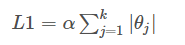
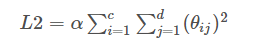

[TOC]

## 1. 交叉验证 Cross validation

### 1. K-fold

K折交叉验证：

​	将初始采样（样本集X，Y）分割成K份，一份被保留作为验证模型的数据（test set），其他K-1份用来训练（train set）。**交叉验证重复K次**，每份验证一次，平均K次的结果或使用其它结合方式，最终得到一个单一估测。

`Provides train/test`<font color=tomato>` indices`</font> `to split data in train/test sets. Split dataset into k consecutive folds (without shuffling by default).`

<font color=tomato>`from sklearn import model_selection`</font>

`KFold(n_splits=3, shuffle=False, random_state=None)`

> `Params:`
>
> >`n_splits : int, default=3. Number of folds. Must be at least 2.`
> >
> >`shuffle: boolean, optional. Whether to shuffle the data before splitting into batches.`
> >
> >`random_state : int, RandomState instance or None, optional, default=None`
>
> `Methods:`
>
> > `get_n_splits(self[, X, y, groups]):Returns number of splitting iterations in cross-validator`
> >
> > `split(self, X[, y, groups]): Generate indices to split data into training and test set`
>
> ```
> >>> import numpy as np
> >>> from sklearn.model_selection import KFold
> >>> X = np.array([[1, 2], [3, 4], [1, 2], [3, 4]])
> >>> y = np.array([1, 2, 3, 4])
> >>> kf = KFold(n_splits=2)
> >>> kf.get_n_splits(X)								  # method: get_n_splits
> 2
> >>> print(kf)  
> KFold(n_splits=2, random_state=None, shuffle=False)
> >>> for train_index, test_index in kf.split(X):			# method: split
> ...    print("TRAIN:", train_index, "TEST:", test_index)
> ...    X_train, X_test = X[train_index], X[test_index]
> ...    y_train, y_test = y[train_index], y[test_index]
> TRAIN: [2 3] TEST: [0 1]
> TRAIN: [0 1] TEST: [2 3]
> ```
>
> 


## 2. 模型评估 Model evaluation

`Model evaluation: quantifying the quality of predictions` [<font color=mediumpurple>`Refer links here`</font>](https://scikit-learn.org/stable/modules/model_evaluation.html#precision-recall-and-f-measures)

`from sklearn import model_selection`


## 3. 数据泄露（data leakage）

​	据科学的中的数据泄露（Data Leakage）和其他场合涉及信息安全的数据泄漏不一样，是指**一些feature不是在因果关系上顺利解释预测值的 ‘因’，而是预测值的 ‘果’**，存在和利用这种**因果倒置的feature的现象**，叫数据竞赛中的Data Leakage。
​	Data Leakage 基本都是竞赛主办方在准备数据或者数据采样的时候出了问题，误将与结果直接相关或存在颠倒因果关系的feature纳入了数据集。这样的纰漏，比较难以发现。
​	在实际竞赛中，我们首先要对数据进行探索，观察是否存在数据泄露并处理。可以从两方面考虑：
​		(1) 训练集和提交的测试集中是否出现了重复的id；
​		(2) 训练集和提交的测试集中是否出现了除id不同，其他特征都一样的情况。

​	泄漏有两种主要类型：**Leaky Predictors** and  **Leaky Validation Strategies**。
​	(1) 当您的预测因素包含无法使用的数据时，就会发生`Leaky Predictors`这种情况，为防止此类数据泄漏，应**排除在目标值实现后更新（或创建）的任何变量**。 因为当我们使用此模型进行新的预测时，该数据将无法使用。
​	(2) 当您不小心区分训练数据和验证数据时，会发生不同类型的泄漏。 例如，如果在调用train_test_split之前运行预处理（比如为缺失值拟合Imputer），就会发生`Leaky Validation Strategies`这种情况。为防止此类数据泄露，**如果您的验证基于简单的train-test-split，则从任何类型的拟合中排除验证数据，包括预处理步骤的拟合**。 如果您使用scikit-learn Pipelines，这会更容易。 使用交叉验证时，使用管道并在管道内进行预处理更为重要

## 100. L1正则和L2正则

`L1 reg` and `L2 reg`:

<div align=center>&nbsp&nbsp</div>

