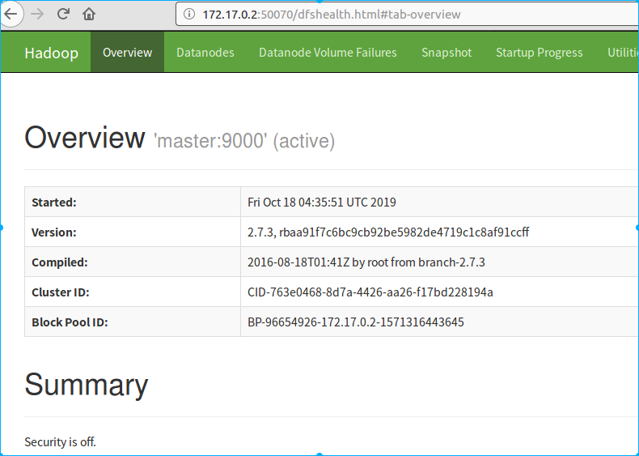
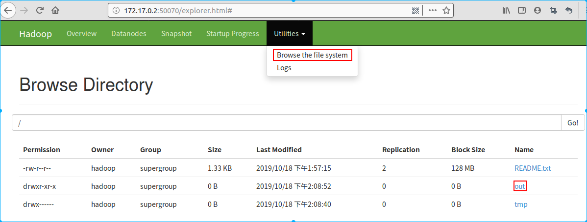
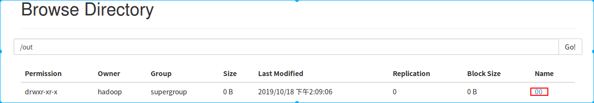
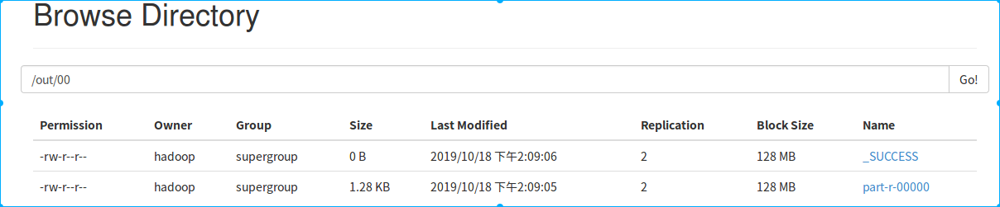

本文内容：	**Docker部署Hadoop集群**

[TOC]

​												

## 1. DOCKER

```
klaus@Messi:~$ docker --version 
Docker version 19.03.3, build a872fc2
# 详细安装见　docker　笔记中文档
```

## 2. centos镜像

新建`centos`文件夹，然后`vim Dockerfile`　（带有 ssh）

```
FROM centos
MAINTAINER klaus

RUN yum install -y openssh-server sudo
RUN sed -i 's/UsePAM yes/UsePAM no/g' /etc/ssh/sshd_config
RUN yum install -y openssh-clients

RUN echo "root:root" | chpasswd
RUN echo "root	ALL=(ALL) ALL" >> /etc/sudoers
RUN ssh-keygen -t dsa -f /etc/ssh/ssh_host_dsa_key
RUN ssh-keygen -t rsa -f /etc/ssh/ssh_host_rsa_key

RUN mkdir /var/run/sshd
EXPOSE 22
CMD ["/usr/sbin/sshd", "-D"]
```

## 3. hadoop+java　镜像

新建`hadoop_java`文件夹，下载java和hadoop本地包至该文件夹下，`jdk-8u101-linux-x64.tar.gz`和`hadoop-2.7.3.tar.gz`；
创建Dockerfile文件　`vim Dockerfile`

```
FROM centos-ssh
ADD jdk-8u101-linux-x64.tar.gz /usr/local/
RUN mv /usr/local/jdk1.8.0_101 /usr/local/jdk1.8
ENV JAVA_HOME /usr/local/jdk1.8
ENV PATH $JAVA_HOME/bin:$PATH

ADD hadoop-2.7.3.tar.gz /usr/local
RUN mv /usr/local/hadoop-2.7.3 /usr/local/hadoop
ENV HADOOP_HOME /usr/local/hadoop
ENV PATH $HADOOP_HOME/bin:$PATH

RUN yum install -y which sudo
```

## 4. 创建 centos-ssh 和 hadoop_cluster 镜像

- centos文件夹下

  ```
   docker build -t centos-ssh .
  ```

- haddop_java文件夹下

  ```
   docker build -t hadoop_cluster
  ```

## 5. 创建hadoop的节点 master slave1 slave2 容器

```
docker run --name master --hostname master -d -p 50070:50070 -p 8088:8088 hadoop_cluster	# 小写　-p

docker run -d --hostname slave1 -P --name slave1 hadoop_cluster		# 大写　-P

docker run -d --hostname slave2 -P --name slave2 hadoop_cluster		# 大写　-P
```

<font color=coral>这里映射端口　:50070要与 hdfs-site.xml　中的　dfs.namenode.http-address 的端口一致</font>
<font color=coral>这里映射端口　:8088 要与 yarn-site.xml　中的　yarn.resourcemanager.webapp.address 的端口一致</font>

> 本文中保持了默认端口，实际创建docker容器时进行了更改，50070 ---> 51020, 8088 ---> 51113 (保存至本地镜像的tar包是修改后的配置)

- 查看３个节点容器对应的ip

```
docker inspect <container_id or name>
# ip1, ip2, ip3
```

## 6. 运行容器，并在容器内设置节点间免密访问

- 如何搭建网桥  ---> 本文不需要搭建网桥（该步骤可省略）

  ```
  $ sudo apt-get install bridge-utils
  $ sudo brctl addbr bridge0
  $ sudo ip addr add 192.168.5.1/24 dev bridge0
  $ sudo ip link set dev bridge0 up
  ```

- 运行容器

  若容器没有处于启动状态，需先执行 `docker start <container_id/name>`开启容器。

  进入容器(以 master 节点为例)：

  ```
  klaus@Messi:~$ docker exec -it master /bin/bash
  [root@master /]#
  # 没有安装vim的话，先安装vim
  [root@master /]# yum -y install vim*
  ```

- **ssh免密互相访问的关键**
  1）**root账户下**修改/etc/hosts文件，将所有节点的 ip　写入文件

  ```
  172.17.0.2      master
  172.17.0.3      slave1
  172.17.0.4      slave2
  ```

  2）**root账户下**创建新用户并设置密码（也可以同时创建组）
  	`useradd hadoop -p 123456 -d /home/hadoop -g hadoopgroup `  # 密码别记错了，我好像设置的是 hadoop
  		`-p:设置密码; -d:设置账户所在目录; -g:设置账户所属的组`

  ```
  # 新建用户组
  groupadd hdpgroup
  # 新建用户hadoop并加入到组hdpgroup
  useradd hadoop -p hadoop -d /home/hadoop -g hdpgroup
  # 切换到 hadoop　并查看用户组
  [root@master /]# su hadoop
  [hadoop@master /]$ groups
  >>> hdpgroup
  ```

  **之后的所有的操作都在新建的账户 hadoop 下进行**

  3）生成密匙并添加授权到 authorized_keys　文件 (可以关注下文件夹和文件的权限)

  ```
  [hadoop@master /]$ ssh-keygen -t rsa
  [hadoop@master /]$ cat /home/hadoop/.ssh/id_rsa.pub > /home/hadoop/.ssh/authorized_keys
  [hadoop@master /]$ /home/hadoop/.ssh/authorized_keys
  >>> 
  ssh-rsa AAAAB3NzaC1yc2EAAAADAQABAAABAQChI/Sg8pDq5OaqTvB9wRy53wrT6qPbb8gXyn/Sijj41IMstc4SdCO8iDK3C4A4igDhSiev9ibQVMVfwuWJbD4hXSuBWXlI8usbmejtn1pwF/P+CjjF22kzN+lTkkcWtLVsLwQRpuUxAyFMKC8OWkaKK73DSgxF60L1xho8FJI6POV6L74f7jG/ARBHC0MdH6A8zoWD+TsaIa6swyCXgnkGNhkKhlIKU0pimjoWdUMvQsC+pcv4OSmm2PwjVTftIVDhunVDftwlg4QpAZpYbn6oH+Ck7SwvbGSUr+D0AAndjcTt4pwIrG15qFV2vlVEt0ppmHR6OUF9Rfnmw+3HLzyX hadoop@master
  ```

  4）<font color=coral>生成的 authorized_keys　文件需要修改权限为　644　（需　su root　进入root账户修改）</font>

  ```
  [hadoop@master /]$ su root
  Password: 
  [root@master /]# chmod 644 /home/hadoop/.ssh/authorized_keys 
  [root@master /]# exit
  exit
  [hadoop@master /]$ ls -l /home/hadoop/.ssh/authorized_keys 
  >>>
  -rw-r--r-- 1 hadoop hdpgroup 395 Oct 17 06:48 /home/hadoop/.ssh/authorized_keys
  ```

  ​	测试 master 节点通过localhost免密登录

  ```
  [hadoop@master /]$ ssh localhost
  The authenticity of host 'localhost (127.0.0.1)' can't be established.
  RSA key fingerprint is SHA256:kyyv+wwBbwoNecGU3CzzbuufHQQnF2xohy+kOJq36lU.
  Are you sure you want to continue connecting (yes/no)? yes
  Warning: Permanently added 'localhost' (RSA) to the list of known hosts.
  Last login: Thu Oct 17 06:43:09 2019
  [hadoop@master ~]$ logout 
  Connection to localhost closed.
  [hadoop@master /]$ ssh localhost
  Last login: Thu Oct 17 06:53:08 2019 from 127.0.0.1
  ```

  5）其他节点类似操作，生成密匙、授权、修改授权文件权限644、测试localhost免密
  6）将节点的公匙添加到其他节点的授权文件中

  ```
  ssh-rsa AAAAB3NzaC1yc2EAAAADAQABAAABAQChI/Sg8pDq5OaqTvB9wRy53wrT6qPbb8gXyn/Sijj41IMstc4SdCO8iDK3C4A4igDhSiev9ibQVMVfwuWJbD4hXSuBWXlI8usbmejtn1pwF/P+CjjF22kzN+lTkkcWtLVsLwQRpuUxAyFMKC8OWkaKK73DSgxF60L1xho8FJI6POV6L74f7jG/ARBHC0MdH6A8zoWD+TsaIa6swyCXgnkGNhkKhlIKU0pimjoWdUMvQsC+pcv4OSmm2PwjVTftIVDhunVDftwlg4QpAZpYbn6oH+Ck7SwvbGSUr+D0AAndjcTt4pwIrG15qFV2vlVEt0ppmHR6OUF9Rfnmw+3HLzyX hadoop@master
  ssh-rsa AAAAB3NzaC1yc2EAAAADAQABAAABAQDrrczZusm9nCPvgF81CquZBMwi+dWkpRz7MTsnJleXomuPk6Eg/XmHstZKReu7MzNefHsaDvWZgTDZt5MK0GhUqi/AyTZwynDFpkIRRw5egS95uGNSkiMKK4gZO/Hd+D/wQ+Abhx8bfjpJcaG8KxPDgkJik+gTJPAOXpmExd+iBV8aPERG4+sS9kLQWCQo/LCQCKMOkgAA1HLBdRdyDjLd8Zxx2WIszsKRcLhKFu0zzzsTx+WCoa0m9nDBLUaxn4DID21/1WlgYSyuqr0C9VInGSqsif6VCbb7/YwCURE7v1Kz+XLI6A/7wIOkFnUp7nl0Hgb3HnnViyMFxGCN+Og/ hadoop@slave1
  ssh-rsa AAAAB3NzaC1yc2EAAAADAQABAAABAQC2Qq+jLYxz/iHZpk9NRi+OAwe+KZ/rdvEaVIn9Lepb2SsfYrgiv7cFTKjU35eZZXLAqVfwPV3vXqMMHimNlI3SowNtbU38ekirAG876UhhNwhy7LPvL+g2zEVZugf8SIaQvIrtFvZNvVCWwrQdTPDPPQ8lZ7n2tN4e4s3eNck4jHWWkMNSkmJ7eeqzoLnlCtZMgSpBMLAxg4MzIV6G9thCCHSBjUoClUdyLYmr5PiihDM5YuoiYSHddWtbC0W8ck6LXLwzKsGEk2xxWeug4NLjsvM5XPuTCKlXCWtFHOto9yaNFmG8d+EoUSXs9HDX80rOt3Ji0ju5uO+OXnrw4MED hadoop@slave2
  ```

  7）测试节点间的免密登录

  ```
  [hadoop@master /]$ ssh slave1
  The authenticity of host 'slave1 (172.17.0.3)' can't be established.
  RSA key fingerprint is SHA256:kyyv+wwBbwoNecGU3CzzbuufHQQnF2xohy+kOJq36lU.
  Are you sure you want to continue connecting (yes/no)? yes
  Warning: Permanently added 'slave1,172.17.0.3' (RSA) to the list of known hosts.
  Last login: Thu Oct 17 07:01:07 2019 from 127.0.0.1
  [hadoop@slave1 ~]$ logout 
  Connection to slave1 closed.
  [hadoop@master /]$ ssh slave1
  Last login: Thu Oct 17 07:07:45 2019 from 172.17.0.2
  [hadoop@slave1 ~]$ 
  ```

  **以上：`[hadoop@master /]$ --> [hadoop@slave1 ~]$ 说明可以实现master免密登录slave1`**

  ```
  [hadoop@slave1 /]$ ssh master
  The authenticity of host 'master (172.17.0.2)' can't be established.
  RSA key fingerprint is SHA256:kyyv+wwBbwoNecGU3CzzbuufHQQnF2xohy+kOJq36lU.
  Are you sure you want to continue connecting (yes/no)? yes
  Warning: Permanently added 'master,172.17.0.2' (RSA) to the list of known hosts.
  Last login: Thu Oct 17 07:07:36 2019 from 127.0.0.1
  [hadoop@master ~]$ logout 
  Connection to master closed.
  [hadoop@slave1 /]$ ssh master
  Last login: Thu Oct 17 07:11:15 2019 from 172.17.0.3
  [hadoop@master ~]$ 
  # slave1可以免密登录master
  ```

  经测试各节点间均可以实现免密登录
  
- 注意：

  <font color=coral>1) 当docker的容器关闭后，再次重新启动时需要重新确定映射关系</font>

  2) 不同服务器节点的<font color=coral>免密互联访问一定是在 hadoop 用户下</font>，在root用户下的话还是急需要密码 (docker exec 进入容 器后确定好映射关系没问题后，su hadoop 切换到hadoop用户下)

  

## 7. 配置hadoop (使用 hadoop 账号,root账号不再使用)

创建hadoop_cluster镜像时已经将java和hadoop安装在了`/usr/local/`目录下，但没有配置环境变量，这里通过在root账户下，设置`/etc/profile`。
**`/etc/profile`**中设定的变量(全局)的可以作用于任何用户,而**`~/.bashrc`**等中设定的变量(局部)只能继承/etc/profile中的变量,他们是"父子"关系.

```
[hadoop@master /]$ su root
Password: 
[root@master /]# vim /etc/profile

# set java envs
export JAVA_HOME=/usr/local/jdk1.8
export JRE_HOME=${JAVA_HOME}/jre
export CLASSPATH=.:${JAVA_HOME}/lib:${JRE_HOME}/lib
export PATH=${JAVA_HOME}/bin:$PATH

# set hadoop envs
export JAVA_HOME=/usr/local/jdk1.8
export HADOOP_INSTALL=/usr/local/hadoop
export PATH=$PATH:$HADOOP_INSTALL/bin
export PATH=$PATH:$HADOOP_INSTALL/sbin
export HADOOP_MAPRED_HOME=$HADOOP_INSTALL
export HADOOP_COMMON_HOME=$HADOOP_INSTALL
export HADOOP_HDFS_HOME=$HADOOP_INSTALL
export HADOOP_YARN_HOME=$HADOOP_INSTALL
export HADOOP_CONF_HOME=$HADOOP_INSTALL

# 测试 java　环境变量设置是否成功　　　---> ok
[hadoop@master /]$ java -version
java version "1.8.0_101"
Java(TM) SE Runtime Environment (build 1.8.0_101-b13)
Java HotSpot(TM) 64-Bit Server VM (build 25.101-b13, mixed mode)
[hadoop@master /]$ 
```

- `hadoop`有如下守护进程`daemon`：

| Daemon                        | Environment Variable        |
| ----------------------------- | --------------------------- |
| NameNode                      | HDFS_NAMENODE_OPTS          |
| DataNode                      | HDFS_DATANODE_OPTS          |
| Secondary NameNode            | HDFS_SECONDARYNAMENODE_OPTS |
| ResourceManager               | YARN_RESOURCEMANAGER_OPTS   |
| NodeManager                   | YARN_NODEMANAGER_OPTS       |
| WebAppProxy                   | YARN_PROXYSERVER_OPTS       |
| Map Reduce Job History Server | MAPRED_HISTORYSERVER_OPTS   |

- `hadoop`全分布式环境搭建规划

| 主机名 | IP   | 功能                            |
| ------ | ---- | ------------------------------- |
| master |      | `NameNode, resourcemanager,snn` |
| slave1 |      | `DataNode, nodemanager`         |
| slave2 |      | `DataNode, nodemanager`         |

注：有datanode节点的服务器就一定要启动nodemanager服务;
		Secondary NameNode主要是用来保存HDFS的元数据信息

- 修改hadoop配置文件, 主要下述几个配置文件，具体见 [官网: Hadoop Cluster Setup](https://hadoop.apache.org/docs/stable/hadoop-project-dist/hadoop-common/ClusterSetup.html)：

```
# 环境配置文件 /usr/local/hadoop/etc/hadoop
hadoop-env.sh
# 核心配置文件 完整的详见官网以下几个对应的默认文档
core-default.xml
hdfs-default.xml
hdfs-rbf-default.xml	
mapred-default.xml
yarn-default.xml 
# 配置datanode节点　slave  /usr/local/hadoop/etc/hadoop
slaves
```

### 1. `hadoop-env.sh`

```
# 添加JAVA_HOME信息: /usr/local/hadoop/etc/hadoop
# The java implementation to use
export JAVA_HOME=/usr/local/jdk1.8

# yarn-env.sh的java设置（设置JAVA_HOME后实际上应该不需要再yarn-env.sh中重新定义JAVA_HOME）
# some java parameters
export JAVA_HOME=/usr/local/jdk1.8
```

### 2. `core-site.xml`

```
<configuration>
<!--配置hdfs文件系统的命名空间(配置这个就可以)-->
<property>
<name>fs.defaultFS</name>
<value>hdfs://master:9000</value>
</property>
<!--配置操作hdfs的缓存大小-->
<property>
<name>io.file.buffer.size</name>
<value>4096</value>
</property>
<!--配置临时数据存储目录（建议也配置）-->
<property>
<name>hadoop.tmp.dir</name>
<value>/home/hadoop/hd_space/tmp</value>
</property>
</configuration>
```

| Parameter             | Value                    | Notes                                            |
| --------------------- | ------------------------ | ------------------------------------------------ |
| `fs.defaultFS`        | NameNode URI             | [hdfs://host:port/](hdfs://host:port/)           |
| `io.file.buffer.size` | `131072 (hd3) 4096(hd2)` | Size of read/write buffer used in SequenceFiles. |

#### 2.1 建立hdfs相关目录

```
[root@master ~]# mkdir -p /home/hadoop/hd_space/tmp
[root@master ~]# mkdir -p /home/hadoop/hd_space/hdfs/name
[root@master ~]# mkdir -p /home/hadoop/hd_space/hdfs/data
[root@master ~]# mkdir -p /home/hadoop/hd_space/mapred/local
```

### 3. `hdfs-site.xml`

```
<configuration>
<!--dfs元数据存储位置:描述数据的数据-->
<property>
<name>dfs.namenode.name.dir</name>
<value>/home/hadoop/hd_space/hdfs/name</value>
</property>
<!--dfs数据存储位置-->
<property>
<name>dfs.datanode.data.dir</name>
<value>/home/hadoop/hd_space/hdfs/data</value>
</property>
<!--副本数-->
<property>
<name>dfs.replication</name>
<value>2</value>
</property>
<!--块大小 hd2:128M-->
<property>
<name>dfs.block.size</name>
<value>134217728</value>
</property>
<!--dfs的namenode的　webUI　地址-->
<property>
<name>dfs.namenode.http-address</name>
<value>master:50070</value>
</property>
<!--dfs的snn的　webUI　地址:这里部署在master服务器-->
<property>
<name>dfs.namenode.secondary.http-address</name>
<value>master:50090</value>
</property>
</configuration>
```

注意：<font color=coral>50070 是默认的 namenode 的端口，创建docker容器时，master的端口映射有两个(namenode和yarn RM的端口)，这两个容器端口必须与这里`hdfs-site.xml　和　yarn-site.xml`里的外部通信地址的端口对应。</font>
		  <font color=coral>本文中我分别改成了 51020和51113，因此在这两个 xml　的配置文件中也要改成51020和51113。</font>

- Configurations for NameNode:

| Parameter                         | Value                                                        | Notes                                                        |
| --------------------------------- | ------------------------------------------------------------ | ------------------------------------------------------------ |
| `dfs.namenode.name.dir`           | `Path on the local filesystem where the NameNode stores the namespace and transactions logs persistently. ` | `If this is a comma-delimited list of directories then the name table is replicated in all of the directories, for redundancy. ` |
| `dfs.hosts` / `dfs.hosts.exclude` | `List of permitted/excluded DataNodes. `                     | `If necessary, use these files to control the list of allowable datanodes. ` |
| `dfs.blocksize`                   | `268435456 `                                                 | `HDFS blocksize of 256MB for large file-systems. `           |
| `dfs.namenode.handler.count`      | `100 `                                                       | `More NameNode server threads to handle RPCs from large number of DataNodes. ` |

- Configurations for DataNode:

| Parameter               | Value                                                        | Notes                                                        |
| ----------------------- | ------------------------------------------------------------ | ------------------------------------------------------------ |
| `dfs.datanode.data.dir` | `Comma separated list of paths on the local filesystem of a `DataNode` where it should store its blocks. ` | `If this is a comma-delimited list of directories, then data will be stored in all named directories, typically on different  devices. ` |

### 4. `mapred-site.xml`

```
<configuration>
<!--指定mapreduce运行框架-->
<property>
<name>mapreduce.framework.name</name>
<value>yarn</value>
</property>
<!--MapReduce中间数据(map输出数据)local位置，dfs.datanode.data.dir存储HDFS数据位置-->
<property>
<name>mapreduce.cluster.local.dir</name>
<value>/home/hadoop/hd_space/mapred/local</value>
</property>
<!--历史服务的通信地址:配置resourcemanager所在的服务器，这里是master-->
<property>
<name>mapreduce.jobhistory.address</name>
<value>master:10020</value>
</property>
<!--历史服务的webUI通信地址:配置resourcemanager所在的服务器，这里是master-->
<property>
<name>mapreduce.jobhistory.webapp.address</name>
<value>master:19888</value>
</property>
</configuration>
```

### 5. `yarn-site.xml`

```
<configuration>
<!--指定rm所启动的服务器主机名-->
<property>
<name>yarn.resourcemanager.hostname</name>
<value>master</value>
</property>
<!--指定mapreduce的shuffle-->
<property>
<name>yarn.nodemanager.aux-services</name>
<value>mapreduce_shuffle</value>
</property>
<!--指定rm的内部通信地址-->
<property>
<name>yarn.resourcemanager.address</name>
<value>master:8032</value>
</property>
<!--指定rm的scheduler的内部通信地址-->
<property>
<name>yarn.resourcemanager.scheduler.address</name>
<value>master:8030</value>
</property>
<!--指定rm的resource-tracker的内部通信地址-->
<property>
<name>yarn.resourcemanager.resource-tracker.address</name>
<value>master:8031</value>
</property>
<!--指定rm的admin的内部通信地址-->
<property>
<name>yarn.resourcemanager.admin.address</name>
<value>master:8033</value>
</property>
<!--指定rm的 webUI 监控地址-->
<property>
<name>yarn.resourcemanager.webapp.address</name>
<value>master:8088</value>
</property>
</configuration>
```

### 6. `slaves`

```
slave1
slave2
# 若需要在 master 服务器上也常见 datanode，则将master也添加到这个　slaves　文件夹中
```

## 8. 远程分发同步到其他服务器

若映射关系丢失，需要先重新确定每个服务器节点的映射关系`/etc/hosts`

- `root`账户下同步资源及配置原件到其他数据节点（部分更改则只同步更改部分即可）

  ```
  # 第一次远程分发时
  [root@master ~]# for target in slave1 slave2
  > do
  > scp -r /usr/local/hadoop/ $target:/usr/local/       
  > scp -r /home/hadoop/hd_space/ $target:/home/hadoop/         
  > scp -r /etc/profile $target:/etc/       
  > done
  # 点击确定，密码提示时输入密码即可(第一次需要)
  ```
  
- 在各节点上加载 `/etc/profile`文件，使配置生效

  ```
  source /etc/profile
  ```

- 各节点上，将文件所有这改成 hadoop 用户

  ```
  chowm -R hadoop:hdpgroup /home/hadoop/hd_space
  chowm -R hadoop:hdpgroup /usr/local/hadoop
  ```
  
- `scp`命令

  ```
  # 语法：scp -r src_dir hostname/ip:dest_dir
  scp -r /usr/local/hadoop/etc/hadoop/hdfs-site.xml slave1:/usr/local/hadoop/etc/hadoop/
  scp -r /usr/local/hadoop/etc/hadoop/hdfs-site.xml slave2:/usr/local/hadoop/etc/hadoop/
  # 可能有用的参数：
      -v 和大多数 linux 命令中的 -v 意思一样 , 用来显示进度 . 可以用来查看连接 , 认证 , 或是配置错误 .
      -C 使能压缩选项 .
      -P 选择端口 . 注意 -p 已经被 rcp 使用 .
      -4 强行使用 IPV4 地址 .
      -6 强行使用 IPV6 地址 .
  ```

## 9. 启动 hadoop

１）第一次启动时，需要在 namenode 服务器上先格式化，只需要一次即可

```
hadoop namenode -format		# 这里的namenode就是namenode，不是master的主机hostname
```

2）启动 namenode, datanode, ResourceManager, NodeName节点 （`/hadoop/sbin`）
    **<font color=coral>当docker的容器关闭后，再次重新启动时需要root权限重新确定映射关系  各节点：`vim /etc/hosts`</font>**

- 全启动：`start-all.sh`   `stop-all.sh`
- 模块启动：
  `start-dfs.sh`  `stop-dfs.sh`  --> `./sbin/start-dfs.sh; ./sbin/stop-dfs.sh`
  `start-yarn.sh` `stop-yarn.sh`
- 单个进程启动：
  `hadoop-daemon.sh start/stop namenode`
  `hadoop-daemons.sh start/stop datenode`
  `yarn-daemon.sh start/stop namenode`
  `yarn-daemons.sh start/stop datenode`
  `mr-jobhistory-daemon.sh start/stop historyserver `

```
cd /usr/local/hadoop
./sbin/start-dfs.sh
./sbin/start-yarn.sh
jps　　# 查看各节点上启动的进程
```

注：**若namenode启动出问题，且有设置 snn, 则会启动`secondary namenode`**(`hdfs-site.xml配置namenode错误，导致启动start-dfs.sh后，jps进程中master没有namenode,而是有secondary namenode进程`)

```
<!--master-->
[hadoop@master hadoop]$ ./sbin/start-dfs.sh 
Starting namenodes on [master]
master: starting namenode, logging to /usr/local/hadoop/logs/hadoop-hadoop-namenode-master.out
slave1: starting datanode, logging to /usr/local/hadoop/logs/hadoop-hadoop-datanode-slave1.out
slave2: starting datanode, logging to /usr/local/hadoop/logs/hadoop-hadoop-datanode-slave2.out
Starting secondary namenodes [master]
master: starting secondarynamenode, logging to /usr/local/hadoop/logs/hadoop-hadoop-secondarynamenode-master.out
[hadoop@master hadoop]$ jps
1714 Jps
1575 SecondaryNameNode
1358 NameNode
[hadoop@master hadoop]$ ./sbin/start-yarn.sh 		
<!--master中启动yarn后，master中进程resourcemanager会启动，对应slave中会启动nodemanager-->
starting yarn daemons
starting resourcemanager, logging to /usr/local/hadoop/logs/yarn-hadoop-resourcemanager-master.out
slave2: starting nodemanager, logging to /usr/local/hadoop/logs/yarn-hadoop-nodemanager-slave2.out
slave1: starting nodemanager, logging to /usr/local/hadoop/logs/yarn-hadoop-nodemanager-slave1.out
[hadoop@master hadoop]$ jps
1575 SecondaryNameNode
2042 Jps
1358 NameNode
1775 ResourceManager
[hadoop@master hadoop]$   

<!--slave1:　启动 start-dfs.sh　和 start-yarn.sh　后的进程-->
[hadoop@slave1 hadoop]$ jps
865 Jps
553 DataNode
700 NodeManager
```

## 10. 测试

- 进入`dfs`的`namenode`的`webUI`界面 　`ip:port` --->  `172.17.0.2:50070`　（docker宿主机ip: 10.180.145.17）

- 宿主机访问：　10.180.145.17:50070(映射docker端口的宿主机端口)  或　172.17.0.2:50070 (docker端口)

- 非宿主机访问：10.180.145.17:50070(映射docker端口的宿主机端口)

  <div align=center></div>

- 进入 `hadoop`的`ResourceManager`的 webUI 监控地址 `ip:port` ---> `172.17.0.2:8088`

- 宿主机访问：　10.180.145.17:8088`(映射docker端口的宿主机端口)  或　172.17.0.2:8088` (docker端口)

- 非宿主机访问：10.180.145.17:8088`(映射docker端口的宿主机端口)

  <div align=center></div>

- 测试`hdfs`文件管理系统

  ```
  # 查看hdfs文件管理系统的根目录文件情况　　/ 表示根目录
  hdfs dfs -ls /
  # 上传当前目录的一个文件到hdfs的根目录
  hdfs dfs -put ./README.txt /
  >>> 
  [hadoop@master hadoop]$ hdfs dfs -ls /				# 可以查看到上传的文件
  Found 1 items
  -rw-r--r--   2 hadoop supergroup       1366 2019-10-18 05:57 /README.txt
  # 查看hdfs的文件内容
  hdfs dfs -cat /README.txt
  ```

- 测试`yarn`

  **集群运行计算的时候，数据一定要是　hdfs 文件系统里面的数据**

  ```
  # 通过yarn执行自带的wordcount来计算文件单词数
  yarn jar ./share/hadoop/mapreduce/hadoop-mapreduce-examples-2.7.3.jar wordcount /README.txt /out/00
  ＃　语法：yarn jar <jar_package> <main_class_in_jar_package> <target_object> <output>
  
  # 查看　yarn　执行命令后输出的结果所在目录
  [hadoop@master hadoop]$ hdfs dfs -ls /out/00
  Found 2 items
  -rw-r--r--   2 hadoop supergroup          0 2019-10-18 06:09 /out/00/_SUCCESS
  -rw-r--r--   2 hadoop supergroup       1306 2019-10-18 06:09 /out/00/part-r-00000
  
  # 查看运行结果的内容
  [hadoop@master hadoop]$ hdfs dfs -cat /out/00/part-r-00000
  >>>
  ...
  distribution	2
  eligible	1
  encryption	3
  exception	1
  export	1
  following	1
  ...
  ```

  `namenode`的`webUI`界面中hdfs文件目录如下：

  <div align=center></div><div align=center></div><div align=center></div>

