本文内容

[TOC]


# 一、Spark 基础解析

## 1. Spark 基础

### 1.1 Spark概述

 - 定义：
   Spark： 基于<font color=coral>内存</font>的快速、通用、可扩展的大数据<font color=coral>分析引擎</font>
   语言：Scala

### 1.2 Spark 内置模块

- Spark SQL 结构化数据、Spark Streaming实时计算、Spark Mlib机器学习

- **Spark Core**   --- 离线计算核心模块, 比MapReduce更快

- 独立调度器、**YARN**(hadoop内的)、Mesos(单独的框架)    ---  资源调度

  <div align=center></div>

### 1.3 Spark特点

<div align=center>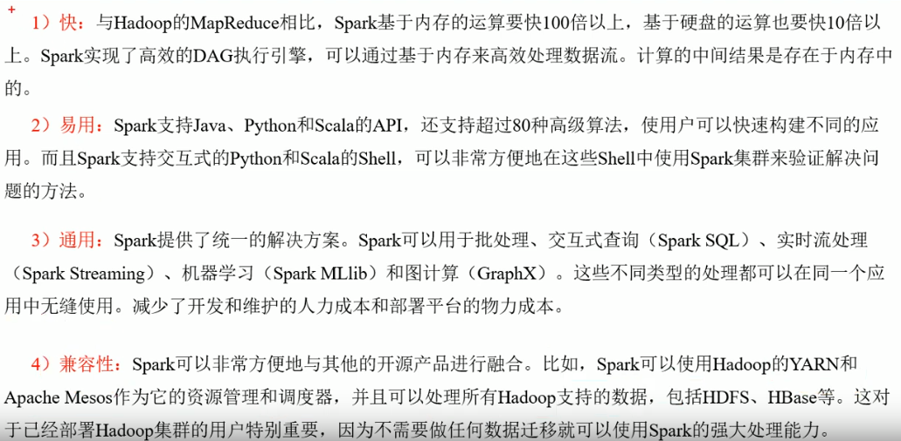</div>

## 2. Spark的运行模式

### 2.1 集群角色

#### 2.1.1 Master 和 Workers

- Master
  Spark 特有资源调度系统的Leader，掌握整个资源信息

  1）监听 workers 是否工作

  2）对Worker、Application等的管理

- Workers

  Spark 特有资源调度系统的 Slave, 有多个，每个 Slave 掌管着所在节点的资源信息

  功能：

  ​	1）通过 RegisterWorker 注册到 Master;

  ​	2）定时发送心跳到 Master

  ​	3）根据 Master 发送的 application 配置进程环境，并启动 StandaloneExecutorBackend （执行 Task 所需的临时进程）

#### 2.1.2 Driver 和 Executor

- Driver (驱动器）

  执行开发程序中的 main 方法的进程 ，即 client : sc 、spark

  工作内容：

  ​	1）把用户程序转为任务

  ​	2）为执行器节点调度任务

  ​	3）跟踪 Executor 的运行状况

  ​	4）UI 展示应用运行状况

- Executor （执行器）
  负责在 Spark 作业中运行任务

  ​	1）负责运行组成 Spark 应用的任务，并将结果返回给 驱动器进程

  ​	2）通过自身的块管理器（Block Manager）为用户程序中要求换成的 RDD 提供内存式存储。 RDD 是直接缓存在 Executor 进程内的，因此任务在运行时充分利用缓存数据急速运算

**总结**：
    <font color=coral>1）Master 和 Worker 是 Spark 的守护进程，即 Spark 在特定模式下正常运行所需要的进程；</font>
    <font color=coral>2）Driver 和 Executor 是临时进程，当有具体任务提交到 Spark 集群时才会开启的进程。</font>

### 2.2 Local 模式

​	单机运行模式

#### 2.2.1 概述

通过以下几种方式集中设置 Master:

- local: 单核，所有计算都运行在一个线程当中，没有任何并行计算
- local[K]：指定线程数来运行计算， local[4]--运行3个Worker线程。通常 cpu 有几个Core, 就指定几个线程，最大化利用 cpu 的计算能力；
- local[*]: 默认安装 cpu 最多Cores 来设置线程数

#### 2.2.2 安装： 详见 [`spark_Install_Envs.md`](./spark_Install_Envs.md) 文件 

#### 2.2.3 提交流程 

- [<font color=coral>官方SparkPI 案例</font>](http://spark.apache.org/docs/2.1.1/submitting-applications.html)

  ```bash
  # Run application locally on 8 cores
  ./bin/spark-submit \
    --class org.apache.spark.examples.SparkPi \    # 主类 Application's main class 
    --master local[8] \
    ./examples/jars/spark-examples_2.11-2.4.4.jar \ # <application-jar>   主类 main 所在的jar包
    100						   # [application-arguments]  主类 main的参数
  ```

- spark-submit  目录位置： /usr/lib/spark-2.4.4-bin-hadoop2.7/bin
  bin目录下 重要的三个文件： `spark-shell`、`spark-sql`、`spark-submit`

- 1）基本语法 

  ```
  ./bin/spark-submit \
    --class <main-class> \			# 主类 Application's main class 
    --master <master-url> \
    --deploy-mode <deploy-mode> \
    --conf <key>=<value> \
    ... # other options
    <application-jar> \				# 主类 main 所在的jar包
    [application-arguments]			 # 主类 main的参数
  ```

- 2）参数说明
  详细参数及说明参考[spark_commands.md](./spark_commands.md)
  `--master` ：制定 Master 的地址；
  `--class `：你的应用的启动类；
  `--deploy-mode`：是否发布你的驱动到 worker 节点（cluster）或者作为一个本地客户端（client）, default: client；
  `--conf `：任意的 Spark 配置属性，格式 key=value, 如果值包含空格，可以加引号"key=value"；
  `--executor-memory 1G`：指定每个 executor 可用内存为1G；
  `--total-executor-cores 2`：指定每个 executor 使用的 cup 核数为2个；

- 3）任务提交

  ```
  $ spark-shell
  >>> ...
      Spark context Web UI available at http://192.168.1.36:4040
      Spark context available as 'sc' (master = local[*], app id = local-1570673879020).
      Spark session available as 'spark'.
      ...
  
  ```

  - spark context web UI

  - spark context （sc）：上下文，提交任务必须从 spark context 开始， 使用 sc 命令提交任务

    (1）local 运行模式执行 wordcount

    ```
    # >>>>>>>>>>>>>>>>>>>>>>>>>>>>>>>>>  word count <<<<<<<<<<<<<<<<<<<<<<<<<<<<<<<<<<
    # 在 /home/klaus/ 下创建txt文件，内容如下：
    	piaodehui piaodehui
        zhangjian laonanren
        laonanren laonanren
        tianshui
        
    # terminal 中 开启 spark-shell 命令， 在 scala> 输入如下命令
    scala> sc.textFile("./word.txt").flatMap(_.split(" ")).map((_,1)).reduceByKey(_+_).collect
    # 结果如下
    res2: Array[(String, Int)] = Array((laonanren,3), (zhangjian,1), (piaodehui,2), (tianshui,1))
    
    # 读取初的数据存储到 sc_output 下
    scala> sc.textFile("./word.txt").flatMap(_.split(" ")).map((_,1)).reduceByKey(_+_).saveAsTextFile("./sc_output"）
    # 查看 sc_output 下的文件，如下
    klaus@ubuntu:~/sc_output$ ls -l
    total 8
    -rw-r--r-- 1 klaus klaus 42 Oct  9 19:45 part-00000
    -rw-r--r-- 1 klaus klaus 13 Oct  9 19:45 part-00001
    -rw-r--r-- 1 klaus klaus  0 Oct  9 19:45 _SUCCESS
    ```

    (2）local模式下的进程和WebUI 如下

    <div align=center>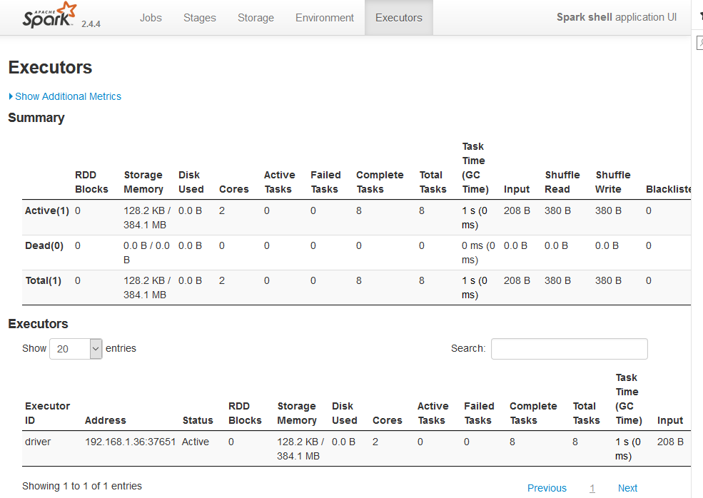</div>

  - spark session：spark-sql 的入口， 使用 spark 命令提交任务

- 3）Spark 通用运行简易流程

<div align=center>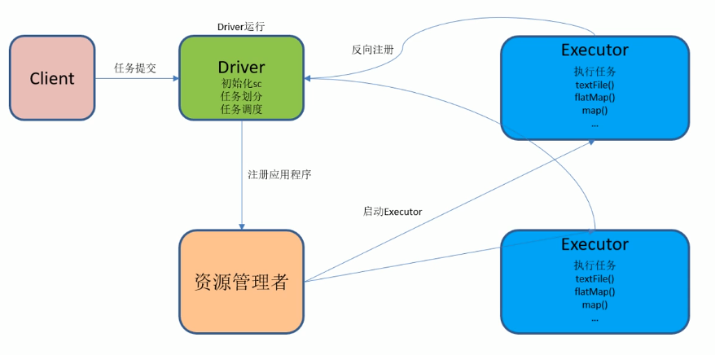</div>

在 Local 模式下， Driver 和 executor 合并为一体，同时包含 Driver和 Executor的功能

#### 2.2.4 数据流程

<div align=center>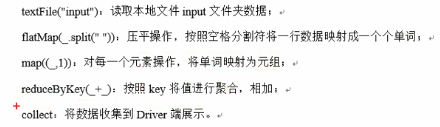</div>

WordCount 案例分析数据流：

<div align=center>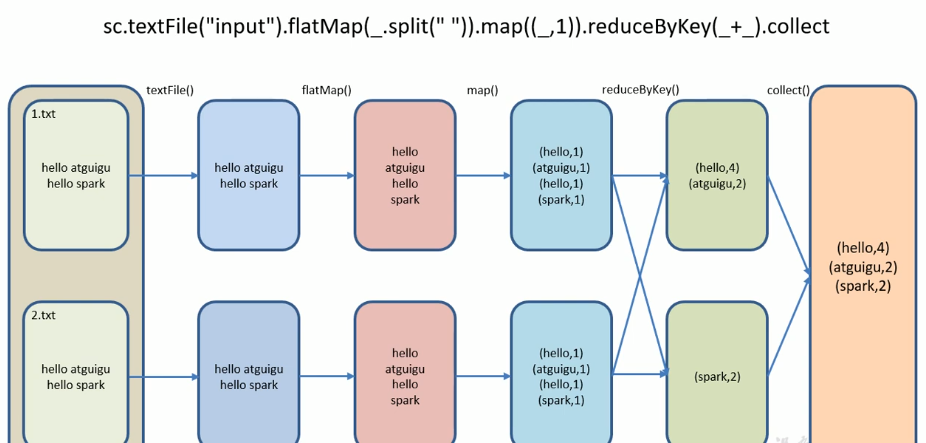</div>


### 2.3 Standalone 模式

#### 2.3.1 概述

构建一个由 Master + Slave 构成的 Spark 集群， Spark 运行在集群中。

- Standalone 运行模式

<div align=center>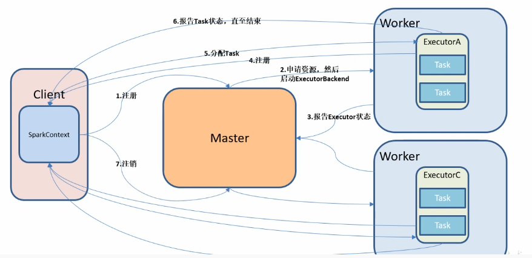</div>

#### 2.3.2 安装使用

- 1）进入spark目录下的conf文件夹：

  ```
  klaus@ubuntu:/usr/lib/spark-2.4.4-bin-hadoop2.7/conf$ ls -l   # 全是 .template
  total 36
  -rw-r--r-- 1 klaus klaus  996 Aug 27 14:30 docker.properties.template
  -rw-r--r-- 1 klaus klaus 1105 Aug 27 14:30 fairscheduler.xml.template
  -rw-r--r-- 1 klaus klaus 2025 Aug 27 14:30 log4j.properties.template
  -rw-r--r-- 1 klaus klaus 7801 Aug 27 14:30 metrics.properties.template
  -rw-r--r-- 1 klaus klaus  865 Aug 27 14:30 slaves.template
  -rw-r--r-- 1 klaus klaus 1292 Aug 27 14:30 spark-defaults.conf.template
  -rwxr-xr-x 1 klaus klaus 4221 Aug 27 14:30 spark-env.sh.template
  ```

- 2）修改配置文件名称（去掉 `.template`）

  ```
  sudo mv slaves.template slaves
  sudo mv spark-defaults.conf.template spark-defaults.conf
  sudo mv spark-env.sh.template spark-env.sh
  ```

- 3）修改 slave 文件，添加如下 work 节点

  ```
  # 注释掉原模板中的 localhost 节点
  hadoop102
  hadoop103
  hadoop104
  ```

- 4）修改 spark-env.sh 文件，添加如下配置

  ```
  SPARK_MASTER_HOST=hadoop102
  SPARK_MASTER_PORT=7077
  ```

- 5）分发 spark 包

  ```
  cd ../..
  xsync spark-2.4.4-bin-hadoop2.7/		# xsync 集群同步脚本
  # xsync filename ： 将filename分发到集群中的各个节点中
  ```

#### 2.3.3 JobHistoryServer 配置

- 1）修改 spark-default.conf.template 名称

  ```
  sudo mv spark-defaults.conf.template spark-defaults.conf
  ```

- 2）修改 spark-default.conf 文件（添加如下内容），开启 Log（写日志）

  ```
  spark.eventLog.enabled           true
  spark.eventLog.dir               hdfs://namenode:8021/directory
  ```

  <font color=coral>注意： HDFS上的目录需要提前存在</font>

- 3）修改 spark-env.sh 文件，添加如下配置 （读日志）

  ```
  export SPARK_HISTORY_OPTS="-Dspark.history.ui.port=18080
  -Dspark.history.retainedApplications=30
  -Dspark.history.fs.logDirectory=hdfs://hadoop102:9000/directory"
  ```

- 参数描述：

  - spark.eventLog.dir ：Application 在运行过程中所有信息均记录在该属性指定的路径下；
  - spark.history.ui.port=18080：webui 访问的端口号；
  - spark.history.fs.logDirectory=hdfs://hadoop102:9000/directory：配置了该属性后，在spark.history-server.sh时就无需显式的指定路径， Spark  History Server 页面只展示该指定路径下的信息

  - spark.history.retainedApplications=30 指定保存 Application 历史记录的个数，如果超过这个值，内存中旧的应用程序信息将被删除，而不是页面上显式的应用数

- 4）分发配置文件

  ```
  xsync spark-defaults.conf
  xsync spark-env.sh
  # 分发后查看集群是否启动，如下图
  util.sh		# spark目录下，但是没看到这个文件存在，不知道啥情况
  ```

<div align=center>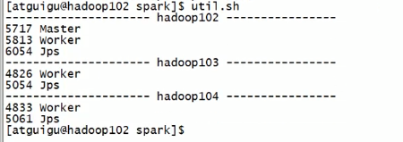</div>

- 5）启动历史服务

  ```
  # spark 目录下
  sbin/start-history-server.sh
  ```

- 6）再次执行任务

  ```
  bin/spark-submit \
  --class org.apache.spark.examples.SparkPi \  
  --master spark://hadoop102:7077 \
  --executor-memory 1G \
  --total-executor-cores 2 \
  ./examples/jars/spark-examples_2.11-2.4.4.jar \ 
  100				
  ```

- 7）查看历史服务

  浏览器输入：<font color=coral>`hadoop102:18080`</font>

#### 2.3.4 HA配置 （高可用配置）

- 1）zookeeper 安装和启动

- 2）修改 spark-env.sh 文件，添加如下配置

  <div align=center>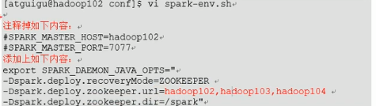</div>


### 2.4 Yarn 模式

#### 2.4.1 概述

​	Spark客户端直接连接Yarn，不需要额外构建Spark集群。有 <font color=coral>yarn-client</font> 和 <font color=coral>yarn-cluster</font> 两种模式，主要区别在于：<font color=coral>Driver 程序的运行节点</font>。

<div align=center>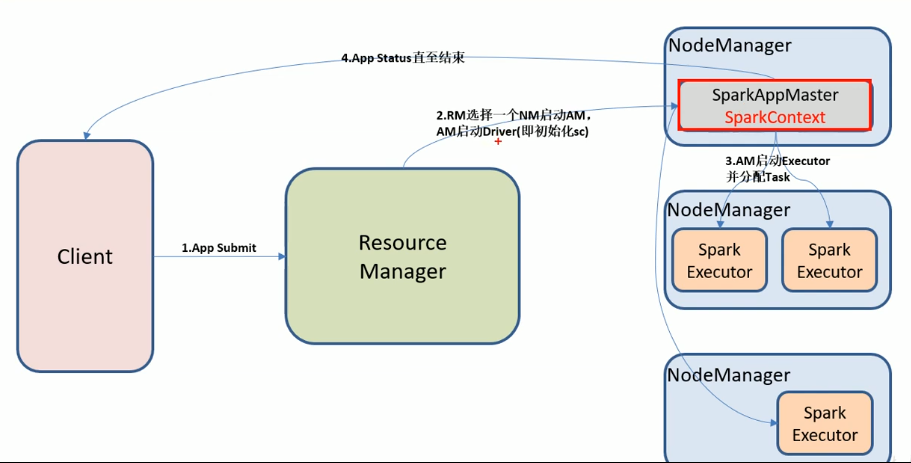</div>

#### 2.4.2 安装使用

- 1）修改 hadoop 配置文件 yarn-site.xml

<div align=center>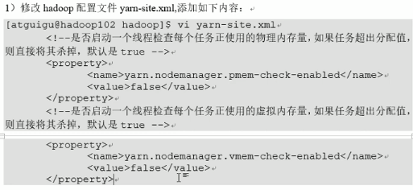</div>

- 2）修改 spark-env.sh, 添加如下配置

  ```
  YARN_CONF_DIR=..../hadoop-2.7.2/etc/hadoop		# .... 表示 hadoop-2.7.2的父级目录
  ```

#### 2.4.3 日志查看

<div align=center>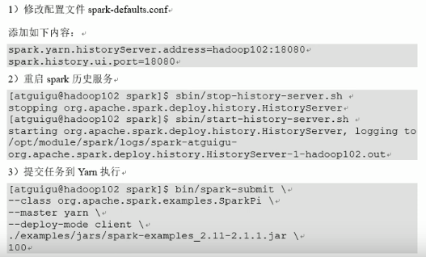</div>

### 2.5 几种模式对比

<div align=center>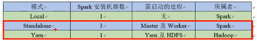</div>

​	yarn 应用更普遍。yarn 安装的Spark主要用来提交jar包。

## 3. 案例实操

​	spark-shell 仅在测试和验证程序时使用较多，生产环境中通常在IDE中F写程序，然后打成 jar 包，提交到集群。最常见的是创建 Maven 项目，利用 Maven 来管理 jar 包的依赖。

### 3.1 编写 WordCount 程序

- 1）创建一个 Maver 项目 wordcount 并导入依赖

  见 [课程](<https://www.youtube.com/watch?v=-6Lh-Lr_2KE&list=PLmOn9nNkQxJF-qlCCDx9WsdAe6x5hhH77&index=20>) 

# 二、SparkCore

## 1. RDD 概述

​	Resilient Distributed Dataset (RDD)：弹性分布式数据集。代码中是一个抽象类，代表一个弹性的、不可变（hash）、可分区，里面的元素可并行计算的集合。

### 1.1 RDD的属性

- 一组分区（partition）,即数据集的基本组成单位
- 一个计算每个分区的函数
- RDD之间的依赖关系
- 一个 partitioner -- 分区器（key-value RDDS才有），即RDD的分片函数
- 一个列表，存储存取每个 partition 的优先位置 (preferred location)

### 1.2 RDD特点

​	RDD表示<font color=coral>只读</font>的分区数据集, 改动智能通过 RDD 的转换操作，由一个 RDD 得到一个新的 RDD。RDDs 之间存在依赖，执行是按照血缘关系延时计算的，如果学员关系较长，可通过持久化 RDD 来切断血缘关系。

#### 1.2.1 弹性

- 存储的弹性：内存与磁盘的自动切换
- 容错的弹性：数据丢失可以自动恢复
- 计算的弹性：计算出错重试机制（可重新调度任务4次）
- 分片的弹性：可根据需要重新分片

#### 1.2.2 分区

#### 1.2.3 只读

​	由一个 RDD 转换到另一个 RDD，可以通过丰富的操作算子实现（mapreduce中只有map和reduce）.
两类操作算子：

- *转换 ( transformations )* 从已经存在的数据集中创建一个新的数据集

  在 Spark 中，所有的<font color=coral>转换(transformations)都是惰性(lazy)的</font>，它们不会马上计算它们的结果。相反的，它们仅仅记录转换操作是应用到哪些基础数据集(例如一个文件)上的。转换仅仅在这个时候计算：当动作(action) 需要一个结果返回给驱动程序的时候。

- *动作 ( actions )* 在数据集上进行计算之后返回一个值到驱动程序

#### 1.2.4 依赖

​	窄依赖：父RDD ---> 子RDD （单向，一对一）
​	宽依赖：父RDD ---> 子RDD （单向，一对多）

#### 1.2.5 缓存

​	RDD 被复用的时候建议做缓存

#### 1.2.6 CheckPoint

<div align=center>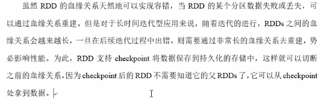</div>


## 2. RDD 编程

### 2.1 编程模型

<div align=center>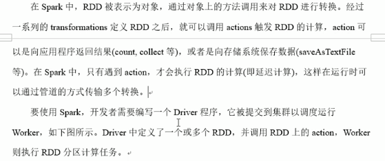</div>

### 2.2 RDD的创建

​	在 Spark 中创建 RDD 的方式有三种：从集合中创建RDD，从外部存储创建RDD，从其他RDD创建（转换）。

#### 2.2.1 从集合中创建

从集合中RDD， Spark 主要提供了两种函数： parallelize 和 makeRDD。

- 1）使用 `parallelize()` 从集和创建

  ```
  scala> val rdd = sc.parallelize(Array(1,2,3,5,6))
  rdd: org.apache.spark.rdd.RDD[Int] = ParallelCollectionRDD[1] at parallelize at <console>:24
  scala> rdd.collect
  res0: Array[Int] = Array(1, 2, 3, 5, 6)
  scala> rdd.partitions.length	# 不指定的话 默认是 totalScores 
  res9: Int = 2		
  
  scala> val ardd = sc.parallelize(Array(1,2,3,5,6,55,9,21),3) 	# 3：分片数
  ardd: org.apache.spark.rdd.RDD[Int] = ParallelCollectionRDD[6] at parallelize at <console>:24
  scala> ardd.partitions.length
  res8: Int = 3
  ```

  函数 `parallelize`定义源码：

  ```
  ... 
  ```

- 2）使用 `makeRDD` 从集合创建

  ```
  # makeRDD 源码2种方式中的一种是直接调用parallelize函数（另一种可以直接指定分配到的节点的hostname）
  scala> val rdd1 = sc.makeRDD(Array(1,2,3,5,6))
  rdd1: org.apache.spark.rdd.RDD[Int] = ParallelCollectionRDD[4] at makeRDD at <console>:24
  
  scala> rdd1.collect
  res5: Array[Int] = Array(1, 2, 3, 5, 6)
  # 常用的makeRDD就是直接调用parallelize函数创建，另一种不常用也不推荐
  
  scala> rdd1.partitions.length		# 分片数
  res6: Int = 2
  ```

#### 2.2.2 由外部存储系统的数据集创建

包括本地文件系统，还有hadoop支持的数据集。

```
val rdd2 = sc.textFile("hdfs://hadoop102:9000/RELEASE")
```

#### 2.2.3 从其他 RDD 创建

详见 2.3节

#### 2.2.4 sc可 调用的方法

<div align=center>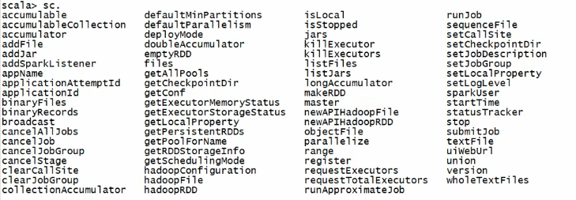</div>

### 2.3  RDD 的转换

#### 2.3.1 Value 类型

`RDD` 整体上分为 `Value` 类型和 `key-value` 类型

##### 2.3.1.1 map(func) 案例

- 1）作用：返回一个新的RDD，该RDD由每一个输入元素经过func函数转换后组成

- 2）需求：创建一个数组的 RDD， 将所有元素 *2 形成新的 RDD

  ```
  scala> val rdd = sc.parallelize(Array(1,2,3,4))
  rdd: org.apache.spark.rdd.RDD[Int] = ParallelCollectionRDD[0] at parallelize at <console>:24
  
  scala> rdd.collect
  res0: Array[Int] = Array(1, 2, 3, 4)                                            
  
  scala> rdd.map(_*2).collect
  res1: Array[Int] = Array(2, 4, 6, 8)
  ```

##### 2.3.1.2 mapPartitions(func)案例

- 1）作用：类似map，但独立地在 RDD 的每一个分片上运行，因此在类型为 T 的 RDD 上运行时，func的函数类型必须是 Iterator[T] => Iterator[U] （map是 [T] => [U]）。假设有 N 个元素，有 M 个分区，那么 map 的函数将被调用 N 次，而 mapPartitions 被调用 M 次，一个函数一次处理所有分区。

- 2）需求：创建一个数组的 RDD， 将所有元素 *2 形成新的 RDD

  ```
  scala> val rdd = sc.parallelize(Array(1,2,3,4))
  scala> rdd.mapPartitions(x=>x.map(_*2)).collect  
  res2: Array[Int] = Array(2, 4, 6, 8)
  # mapPartitions属于 spark 的函数，x=>x.map(_*2)中的 map 属于 scala 语言中的函数
  
  # 将 元素连接起来 x=>Iterator(x.mkString("|")) 不能用 Iterator(_.mkString("|")) 简化
  scala> rdd.mapPartitions(x=>Iterator(x.mkString("|"))).collect
  res4: Array[String] = Array(1|2, 3|4)
  ```

  就近原则：

  `x=>Iterator(x.mkString("|")) : Iterator(_.mkString("|"))`   

  ​	scala运行时会将后者简化格式先转化为完整的格式，即 `expanded function ((x$1) => x$1.mkString("|"))`,由于遵循 就近原则（expand 时就近找最近邻的一个括号来扩展），则实际上 `Iterator(_.mkString("|"))`扩展后的结果并不是 `x=>Iterator(x.mkString("|"))`，而是如下结果：

  `Iterator(_.mkString("|")) 扩展为： y=>Iterator(x=>x.mkString("|"))`，出现 类型丢失(x不仅没定义类型，也没输入)

  因此，才有如下不一样的扩展情况：

  - `rdd.map(x=>x*2)`  <font color=coral>`==`</font> `rdd.map(_*2)`

  ```
  scala> rdd.map(x=>x*2).collect
  res7: Array[Int] = Array(2, 4, 6, 8)
  scala> rdd.map(_*2).collect
  res8: Array[Int] = Array(2, 4, 6, 8)
  ```

  - `rdd.mapPartitions(x=>Iterator(x.mkString("|")))` <font color=coral>`!=`</font>  `rdd.mapPartitions(Iterator(_.mkString("|")))`

  ```
  scala> rdd.mapPartitions(x=>Iterator(x.mkString("|"))).collect
  res4: Array[String] = Array(1|2, 3|4)
  scala> rdd.mapPartitions(Iterator(_.mkString("|"))).collect
  <console>:26: error: missing parameter type for expanded function ((x$1) => x$1.mkString("|"))
  Error occurred in an application involving default arguments.
         rdd.mapPartitions(Iterator(_.mkString("|"))).collect
  ```

  又如：

  ```
  x=>(x+1)*2  ==  (_+1)*2   
  ((_+1)*2)  扩展后是： y=>(x=>x+1)*2   # x 没定义，也没输入的引用
  ```

  ##### 2.3.1.3 mapPartitionsWithIndex(func) 案例

  - 1）作用：

  - 2）需求：数组==》（分片号，数据）格式

    ```
    scala> val rdd1 = sc.parallelize(Array(1,2,3,4,5,6,7,8,9,10,11), 3)
    scala> val rdd1withPartIndex = rdd1.mapPartitionsWithIndex((i,items)=>items.map(x=>(i,x)))
    scala> rdd1withPartIndex.collect
    res13: Array[(Int, Int)] = Array((0,1), (0,2), (0,3), (1,4), (1,5), (1,6), (1,7), (2,8), (2,9), (2,10), (2,11))
    # 3个分片，转化后的新rdd格式为 （分片序号，数据）
    # 11个数分3个分区，最后分区情况为 0:3个数据，1:4个数据，2:4个数据
    ```

  - 分区规则（源码如下）-- 分区规则是在 RDD 创建`parallelize`的时候规定好的,不是转换的时候确定的：

    <div align=center>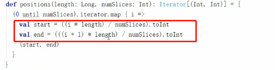</div>

    比如对于数据长度 11， 分区为3 的 rdd， 转换后的 （index, value）中 index 对应的 value 的数量计算如下：

    ```
    for i in index:
    	start = int((i * length) / numslice)
    	end = int(((i + 1 ) * length) / numslice)
    # i = 0: start=int(0*11/3), end=int(1*11/3) --> [0,3]  3个数	# [start, end) 均为前闭后开
    # i = 1: start=int(1*11/3), end=int(2*11/3) --> [3,7]  4个数
    # i = 2: start=int(2*11/3), end=int(3*11/3) --> [7,11] 4个数
    ```

##### 2.3.1.4 map() 和 mapPartitions() 的区别

- 1）map()： 每次处理一条数据

- 2）mapPartitions()：每次处理一个分区的数据，这个分区的数据处理完后，原 RDD 中分区的数据才能释放，可能导致**OOM（内存溢出）**。

- 开发指导：当内存空间较大时建议使用 mapPartitions()，以提高处理效率

  mapPartitions 中的 map 是 scala 的map函数（操作scala集合）；map()中的 map 是 spark 的 map 函数（操作 RDD）,可以通过函数跳转查看 map 函数所在源码是属于scala还是spark的；建议采用mapPartitions()能提高效率是以为 <font color=coral>`scala`的`map`函数效率比`spark`的`map`函数效率高</font>。

##### 2.3.1.5 flatMap(func) 案例

- 1）作用：压平操作，类似 map，但是每一个输入元素可以被映射为0或多个输出元素（因此 func应该返回一个序列，而不是单一元素）

- 2）需求：元素flatten

  ```
  scala> val rdd = sc.textFile("words.txt").flatMap(_.split(" ")).collect
  rdd: Array[string] = Array(hadoop spark, hive oozie scala)
  
  # content in words.txt
      hadoop spark
      hive oozie scala
  ```

##### 2.3.1.6 glom 案例

- 1）作用：将每一个分区形成一个数组，形成新的 RDD 类型时 RDD[Array[T]]

  `def glom(): org.apache.spark.rdd.RDD[Array[Int]]`

  ```
  scala> val rdd = sc.parallelize(Array(1,2,3,4,5,6,7,8,9,10,11), 3)
  scala> rdd.glom.collect
  res0: Array[Array[Int]] = Array(Array(1, 2, 3), Array(4, 5, 6, 7), Array(8, 9, 10, 11))
  ```

##### 2.3.1.7 groupBy() 案例

- 1）作用：分组

  `def groupBy[K](f: Int => K)(implicit kt: scala.reflect.ClassTag[K]): org.apache.spark.rdd.RDD[(K, Iterable[Int])]`

  返回的RDD格式：<font color=coral> `(K, Iterable[Int])`</font>

  按照奇偶数分组：

  ```
  scala> rdd.collect
  res2: Array[Int] = Array(1, 2, 3, 4, 5, 6, 7, 8, 9, 10, 11)
  
  scala> rdd.groupBy(x=>x%2==0).collect		# x%2==0 Boolean类型
  res3: Array[(Boolean, Iterable[Int])] = Array((false,CompactBuffer(1, 3, 5, 7, 9, 11)), (true,CompactBuffer(2, 4, 6, 8, 10)))
  
  scala> rdd.groupBy(x=>x%2).collect
  res4: Array[(Int, Iterable[Int])] = Array((0,CompactBuffer(2, 4, 6, 8, 10)), (1,CompactBuffer(1, 3, 5, 7, 9, 11)))
  ```


## 3. 键值对 RDD 数据分区


## 4. 数据读取与保存


## 5. RDD 编程进阶


## 5. Spark SQL


## 6. Spark Streaming

