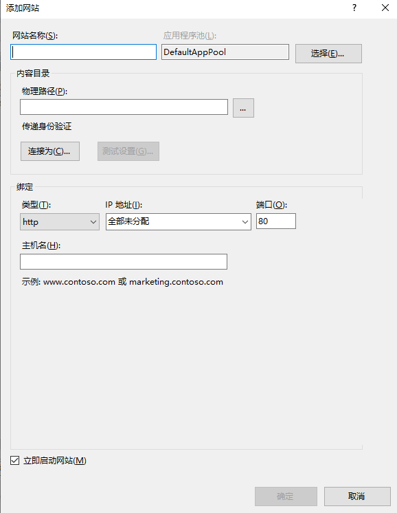
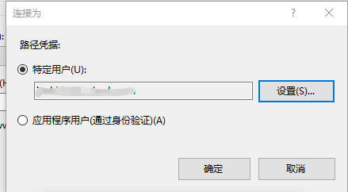

本文内容

[TOC]

[`refer-1: 教程-使用 ASP.NET Core 创建 Web API`](https://docs.microsoft.com/zh-cn/aspnet/core/tutorials/first-web-api?view=aspnetcore-2.1&tabs=visual-studio)
[`refer-2: `]

# 一、API创建及基本设置

## 概述

本文介绍使用 ASP.NET Core 构建及部署 Web API 的基础知识，包含：

- 创建 Web API 项目。
- 添加模型类和数据库上下文。
- 添加控制器。
- 添加 CRUD 方法。
- 配置路由和 URL 路径。
- 指定返回值。
- 使用 JavaScript 调用 Web API。

创建的webapi的请求方式：

| API                    | 说明             | 请求正文 | 响应正文       |
| :--------------------- | :--------------- | :------- | :------------- |
| GET /api/tgpro         | 获取所有待办事项 | 无       | 待办事项的数组 |
| GET /api/tgpro/{id}    | 按 ID 获取项     | 无       | 待办事项       |
| POST /api/tgpro        | 添加新项         | 待办事项 | 待办事项       |
| PUT /api/tgpro/{id}    | 更新现有项       | 待办事项 | 无             |
| DELETE /api/tgpro/{id} | 删除项           | 无       | 无             |


## 系统环境

- `Visual Studio 2019` 与 `ASP.NET 和 Web 开发 工作负载`

- .NET Core SDK 2.2 （sdk和runtime都需要安装）

  官网下载：dotnet-hosting-2.2.6-win.exe、dotnet-sdk-2.2.401-win-x64.exe

## 创建WebAPI项目

- 从“文件”菜单中选择“新建”>“项目” 。
- 选择“ASP.NET Core Web 应用程序”模板，再单击“下一步” 。
- 将项目命名为 tgproApi，然后单击“创建” 。
- 在“创建新的 ASP.NET Core Web 应用程序”对话框中，确认选择“.NET Core”和“ASP.NET Core 2.2” 。 选择“API”模板，然后单击“创建” 。 请不要选择“启用 Docker 支持” 。

## 测试 API

项目模板会创建 `values` API。 从浏览器调用 `Get` 方法以测试应用。
按 Ctrl+F5 运行应用 或 下图红框选择`tgproApi`点击运行。 Visual Studio 启动浏览器并导航到 `https://localhost:<port>/api/values`，其中 `<port>` 是随机选择的端口号。

<div align=left>&nbsp&nbsp </div>

## 添加模型类

- 在“解决方案资源管理器” 中，右键单击项目。 选择“添加” > “新建文件夹” 。 将文件夹命名为“Models” 。

- 右键单击“Models” 文件夹，然后选择“添加” > “类” 。 将类命名为 `tgproItem`，然后选择“添加” 。

- 代码如下：

  ```
  using System;
  using System.Collections.Generic;
  using System.Linq;
  using System.Threading.Tasks;
  
  namespace tgproApi.Models
  {
      public class tgproItem
      {
          // Data: 上行传输数据，对应接口id=1, 下行控制数据皆为null: 
          public long Id { get; set; }
          public string Time_domain { get; set; }
          public string Time_envelop { get; set; }
          public string Freq_domain { get; set; }
          public long Freq_xlim_min { get; set; }
          public long Freq_xlim_max { get; set; }
          public string Unbalance { get; set; }
          public long Unbalance_xlim_min { get; set; }
          public long Unbalance_xlim_max { get; set; }
          public string Frequency_rpm { get; set; }
          public string Ub_recom_case { get; set; }
          // control：下行控制流数据，对应接口id=2, 上行数据皆为null
          public long Index_cnc { get; set; }
          public long Index_trial { get; set; }   
          // 0: initial, 1: 0 degree,  2: 180 degree, 3: 90 degree
      }
  }
  ```

  `Id` 属性用作关系数据库中的唯一键。
  模型类可位于项目的任意位置，但按照惯例会使用 Models 文件夹。

## 添加数据库上下文

数据库上下文是为数据模型协调 Entity Framework 功能的主类 。 此类由`Microsoft.EntityFrameworkCore.DbContext` 类派生而来。

- 右键单击“Models” 文件夹，然后选择“添加” > “类” 。 将类命名为 `tgproContext`，然后单击“添加” 。

- 代码如下：

  ```
  using System;
  using System.Collections.Generic;
  using System.Linq;
  using System.Threading.Tasks;
  using Microsoft.EntityFrameworkCore;
  
  namespace tgproApi.Models
  {
      public class tgproContext : DbContext
      {
          public tgproContext(DbContextOptions<tgproContext> options) : base(options)
          {
          }
          
          public DbSet<tgproItem> tgproItems { get; set; }
      }
  }
  ```

## 注册数据库上下文及跨域请求配置

在 ASP.NET Core 中，服务（如数据库上下文）必须向依赖关系注入 (DI)容器进行注册。 该容器向控制器提供服务。

- 将数据库上下文添加到 DI 容器

- 指定数据库上下文将使用内存中数据库

- 配置跨域请求服务，使用命名的策略和中间件的 CORS （同时需在控制器启用CORS应用到定义的API方法）

- 代码如下：

  ```
  using System;
  using System.Collections.Generic;
  using System.Linq;
  using System.Threading.Tasks;
  using Microsoft.AspNetCore.Builder;
  using Microsoft.AspNetCore.Hosting;
  using Microsoft.AspNetCore.HttpsPolicy;
  using Microsoft.AspNetCore.Mvc;
  using Microsoft.Extensions.Configuration;
  using Microsoft.Extensions.DependencyInjection;
  using Microsoft.Extensions.Logging;
  using Microsoft.Extensions.Options;
  using tgproApi.Models;
  using Microsoft.EntityFrameworkCore;
  
  namespace tgproApi
  {
      public class Startup
      {
          public Startup(IConfiguration configuration)
          {
              Configuration = configuration;
          }
  
          public IConfiguration Configuration { get; }
  
          // This method gets called by the runtime. Use this method to add services to the container.
          public void ConfigureServices(IServiceCollection services)
          {
              // 配置跨域 start
              services.AddCors(options =>
              {
                  options.AddPolicy("any", builder =>
                  {
                      builder.AllowAnyOrigin()        // 允许任何来源的主机访问
                      .AllowAnyMethod()
                      .AllowAnyHeader()
                      .AllowCredentials();            // 指定处理 cookie (目前还不知道有什么用)
                  });
              });
              // 配置跨域 end
  
              // 注册InmemoryDatabase 服务 start
              services.AddDbContext<tgproContext>(opt => opt.UseInMemoryDatabase("DataList"));
              // 注册 InmemoryDatabase 服务  end
              services.AddMvc().SetCompatibilityVersion(CompatibilityVersion.Version_2_2);
          }
  
          // This method gets called by the runtime. Use this method to configure the HTTP request pipeline.
          public void Configure(IApplicationBuilder app, IHostingEnvironment env)
          {
              if (env.IsDevelopment())
              {
                  app.UseDeveloperExceptionPage();
              }
              else
              {
                  // The default HSTS value is 30 days. You may want to change this for production scenarios, see https://aka.ms/aspnetcore-hsts.
                  app.UseHsts();
              }
  
              // 使用跨域 start  UseCors 必须在UseMvc 之前调用
              app.UseCors("any");
              // 使用跨域 end
  
              //app.UseHttpsRedirection();       // 需要注释掉，不注释掉的话会重定向 https，不需要安全验证 用 http即可
              app.UseMvc();
          }
      }
  }
  ```

## 添加控制器并定义方法

- 右键单击 Controllers 文件夹。

- 选择“添加”>“新项” 。

- 在“添加新项”对话框中，选择“API 控制器类” (`API Contriller Class`)模板 。

- 将类命名为 tgproController，然后选择“添加” 。

- 方法定义及跨域策略启用代码如下：

  ```
  using System;
  using System.Collections.Generic;
  using System.Linq;
  using System.Threading.Tasks;
  using tgproApi.Models;
  using Microsoft.AspNetCore.Cors;
  using Microsoft.EntityFrameworkCore;
  using Microsoft.AspNetCore.Mvc;         // using 后 controller才能继承 ControllerBase
  
  namespace tgproApi.Controllers
  {
      // Controller 设置方法跨域 start
      [EnableCors("any")]
      // Controller 设置方法跨域 end
  
      // 设置路由 start
      [Route("api/[controller]")]
      [ApiController]
      // 设置路由 end
      public class tgproController : ControllerBase
      {
          private readonly tgproContext _context;
  
          public tgproController(tgproContext context)
          {
              _context = context;
  
              if (_context.tgproItems.Count() == 0)
              {
                  // Create a new TodoItem if collection is empty,which means you can't delete all TodoItems.
                  _context.tgproItems.Add(new tgproItem { update_status = 0 , Api_type = "data_flow"});
                  _context.tgproItems.Add(new tgproItem { Api_type = "control_flow" });
                  _context.SaveChanges();
              }
          }
  
          // Get:api/tgpro
          [HttpGet]
          public async Task<ActionResult<IEnumerable<tgproItem>>> GettgproItems()
          {
              return await _context.tgproItems.ToListAsync();
          }
  
          // Get: api/tgpro/5
          [HttpGet("{id}")]
          public async Task<ActionResult<tgproItem>> GettgproItem(long id)
          {
              var tgproItem = await _context.tgproItems.FindAsync(id);
              if (tgproItem == null)
              {
                  return NotFound();
              }
              return tgproItem;
          }
  
          // POST: api/tgpro
          [HttpPost]
          public async Task<ActionResult<tgproItem>> PosttgproItem(tgproItem item)
          {
              _context.tgproItems.Add(item);
              await _context.SaveChangesAsync();
              return CreatedAtAction(nameof(tgproItem), new { id = item.Id }, item);
          }
  
          // PUT: api/tgpro/5
          [HttpPut("{id}")]
          public async Task<IActionResult> PuttgproItem(long id, tgproItem item)
          {
              if (id != item.Id)
              {
                  return BadRequest();
              }
              _context.Entry(item).State = EntityState.Modified;
              await _context.SaveChangesAsync();
              return NoContent();
          }
  
          // DELETE: api/tgpro/5
          [HttpDelete("{id}")]
          public async Task<IActionResult> DeletetgproItem(long id)
          {
              var tgproItem = await _context.tgproItems.FindAsync(id);
  
              if (tgproItem == null)
              {
                  return NotFound();
              }
              _context.tgproItems.Remove(tgproItem);
              await _context.SaveChangesAsync();
              return NoContent();
          }
      }
  }
  ```

## jQuery测试：使用ajax函数调用接口(后续补代码)

抽空补

# 二、启动webapi方式对比

通过vs启动webapi有几种不同方式，可以通过本地项目启动，也可以通过IIS Express启动，还可以将webapi部署至IIS服务器启动。

- 若ip属于自动获取的ip，ip变更之后设置了固定ip地址的地方需要相应地更改

## 1）设置本机项目启动，并 localhost:port 访问为  ip:port 访问

- 如下图，1处右键，在弹出界面2处选择`调试`, 在4处选择 `tgpro` 和 `项目`， 更改3处的`localhost`为本机`ip`, 保存

  <div align=center></div>

- 也可追加localhost访问，在应用URL中添加`http://localhost:5000;`,即可localhost访问，也可ip访问，如下：

  ```
  "applicationUrl": "https://192.168.1.17:5001;http://192.168.1.17:5000;http://localhost:5000;"
  ```

  <div align=center> </div>

- 运行程序，弹出界面如下图上，监听的地址已经由 `localhost`变更为 `本机ip`；同时`launchSettings.json`文件中的`tgproApi`的`applicationUrl`也相应地变更为`本机ip`

  注: 1)  运行程序要选择下图下中最上方的`tgproApi`，而不是选择 `IIS Express`

  ​      2) `API`连接必须先<font color=coral>启动`tgpro`项目</font>（部署到服务器后不用启动项目即可连接`API`） 

  <div align=center>  </div>

  在浏览器中输入`http://192.168.1.17:5000/api/tgpro`, 内容如下图

  <div align=center></div>

## 2）设置IIS Express启动，且允许ip地址访问

<font color=coral>IIS Exress默认只支持localhost访问，不支持ip访问</font>
项目属性界面默认设置如下图：

<div align=center> </div>

点击1处启动程序，运行结果如下图所示，启用了ssl，且只能用localhost访问，ip访问失败（IIS Express默认只支持localhost访问）：

<div align=center> </div>

查看`~\.vs\dataflowApi\config`中对`applicationhost.config`中的`<site>`绑定信息，如下：

```
<bindings>
    <binding protocol="http" bindingInformation="*:54325:localhost" />
    <binding protocol="https" bindingInformation="*:44302:localhost" />
</bindings>
```

更改3处localhost为ip地址如192.168.1.17，运行结果如下图，说明IIS Express设置ip访问不能仅仅在这里替换（注：此时若再替换回localhost，点击IIS Express启动程序，仍会出现下图错误，需重启程序后才能正常访问）：

<div align=center> </div>

下面讨论如何设置IIS Express实现ip访问。`~\.vs\dataflowApi\config`中对`applicationhost.config`进行设置。
	1）首先取消掉SSL, 只采用 http 访问，运行后访问端口就不再是上文途中的 `44302`(https对应端口), 而是`54325`(http对应端口)。对应地，`launchSettings.json`文件中的`sslport`更新为了`0："sslPort": 0`；`~\.vs\dataflowApi\config`中对`applicationhost.config`中的`<site>`绑定信息变更为如下所示：

```
<bindings>
	<binding protocol="http" bindingInformation="*:54325:localhost" />
</bindings>
```

​	2）更改`~\.vs\dataflowApi\config`中对`applicationhost.config`中`<bindings>`内容再追加一条ip设置的bingding,如下（更改`applicationhost.config`文件，vs中的`launchSettings.json`中的信息不变）。此时直接`IIS Express`启动仍会出现“无法连接到web服务器”的错误，原因（下文有介绍）在于<font color=coral>`IIS Express`绑定了`IP`访问属于需要管理员权限的特例之一</font>。关闭vs后重新以<font color=coral>管理员身份打开并启动</font>>，结果如下图所示：

```
<bindings>
    <binding protocol="http" bindingInformation="*:54325:localhost" />
    <binding protocol="http" bindingInformation="*:54325:192.168.1.17" />	<!-- 改为自己的ip -->
</bindings>
```

<div align=center></div>


## 3）API发布及IIS服务器部署

- IIS服务器部署后，网站一直处于静默启动状态，不需要每次启动程序运行(IIS Express需要每次以管理员身份启动程序)，若关闭网站，需在IIS管理器建立的站点主页关闭或重启。
- `webapi`接口内容写好后，右键解决方案，调试界面的 `启用SSL`勾选掉，不采用https协议，http即可；

<div align=center></div>

- 发布WebApi

  右键解决方案，选择 `发布`， 如图下图左，点击`发布`， 弹出图右界面，选择 `文件系统`， 目标位置为发布的地址，可以本地自行设置路径如`E:\publish`，点击`下一页`, 设置目标框架`netcoreapp2.2`， 目标运行时为`可移植`， 点击 `保存`，直接`发布`即可。

  <div align=center> </div>

  或者，本地新建好待发布的路径，以`dotnet pulish ...`命令发布, 详细发布命令的参数及命令如下图所示：

  - ` dotnet publish [选项] <PROJECT>`

    - ` -o, --output <OUTPUT_DIR> `            要放置已发布项目的输出目录
    -  `-f, --framework <FRAMEWORK>`           要发布的目标框架。必须在项目文件中指定目标框架
    - `-c, --configuration <CONFIGURATION> `  要发布的配置。大多数项目的默认值是 "Debug"

  - `command: `

    `dotnet publish -o E:\publish -f netcoreapp2.2 -c Release D:\dataflowApi\dataflowApi.sln`

  <div align=center> </div>

- IIS部署

  控制面板\系统和安全\管理工具  --> 双击`Internet Information Services (IIS)管理器`

  - 查看 `模块` 中是否存在 `AspNetCoreModuleV2`和 `AspNetCoreModuleV`, 没有的话说明环境未安装好，需要自行安装

  - 如下图，右键红框，选择  添加网站

    <div align=center> </div>

  - 弹出界面，如下图，网站名称自拟，<font color=coral>物理路径选择 发布路径</font>, IP可以不填(以本机ip访问)，端口不适用默认端口，自己设置如`6666`； 

    <div align=center></div>

    (这一步可省略，但还是建议设置以获得对publish目录的访问权限) 点击 `测试设置` 如下图左图，`授权`最好设置获得对物理路径的访问权限, 设置如下图右图，设置特殊用户，弹出界面中设置PC的账户和密码，再回看`测试设置`是否具有访问权限， 设置ok后点击`确定`

    <div align=center> </div>

    设置好的站点如图所示

    <div align=center></div>

  - 点击 `应用程序池`， 如下图，选中新建的站点并点击基本设置，设置 `.NET CLR版本`为 <font color=coral>无托管代码</font>, 确定

    <div align=center></div>


### **!! key !!**  解决IIS无法识别PUT和DELETE接口方法的问题

[`refer1: <让IIS7和IIS6识别PUT和DELETE请求>`](https://www.cnblogs.com/gudi/p/6721704.html))
[`refer2: <Asp.Net Core IIS发布后PUT、DELETE请求错误405.0 - Method Not Allowed 因为使用了无效方法(HTTP 谓词)>`](https://blog.csdn.net/zyh444/article/details/82886864)

​	`webapi`在IIS服务器部署好之后，测试定义的四种接口方法`GET POST PUT DELETE`,发现只有`GET POST`两种方法有效，`PUT DELETE`两种方法无效，网上查询后才知道<font color=coral>目前`IIS`配置默认不支持`PUT`和`DELETE`的谓词</font>, 详细分析可以参考 refer1 个 refer2 两篇博文, 解决方案也都有陈述。
​	本文采用的解决方法如下：

 - 修改 发布后的 `web.config`文件，去除`WebDAVModule`，代码如下，然后`IIS`管理器站点重新启动（IIS部署后网站的停止/重新启动都需要在IIS管理器中实现）：

   ```
       <modules runAllManagedModulesForAllRequests="true">  
         <remove name="WebDAVModule" />  
       </modules>  
   ```

   `web.config`文件完整代码如下，<!-- remove webdev ：start -->和<!-- remove webdev : end -->之间是添加的代码：

   ```
   <?xml version="1.0" encoding="utf-8"?>
   <configuration>
     <location path="." inheritInChildApplications="false">
       <system.webServer>
   	  <!-- remove webdev ：start -->
   	  <modules runAllManagedModulesForAllRequests="true">  
           <remove name="WebDAVModule" />  
         </modules>  
   	  <!-- remove webdev : end -->
         <handlers>
           <add name="aspNetCore" path="*" verb="*" modules="AspNetCoreModuleV2" resourceType="Unspecified" />
         </handlers>
         <aspNetCore processPath="dotnet" arguments=".\dataflowApi.dll" stdoutLogEnabled="false" stdoutLogFile=".\logs\stdout" hostingModel="InProcess" />
       </system.webServer>
     </location>
   </configuration>
   <!--ProjectGuid: 82415831-6068-4df4-ae91-d53e345bba89-->
   ```

- 重新启动站点后，测试`webapi`，可以实现`PUT`和`DELETE`方法。

# 三、IIS与IIS Express的区别

[`refer for IIS Express <IIS Express 总结>`](<https://www.cnblogs.com/xcsn/p/8232664.html>)

## IIS Express和IIS

IIS Express源于IIS 7及以上，支持IIS的核心特性，但有一些关键区别。一个重要的区别是工作进程的管理.
	在<font color=coral>IIS</font>，**Windows进程激活服务（Windows Process Activation Service【WAS】）**是<font color=coral>静默激活和停用的Web应用程序，用户没有直接控制</font>。
	在<font color=limegreen>IIS Express</font>>中，不存在WAS，<font color=limegreen>用户可完全控制应用程序的激活和停用</font>>。启动后在系统托盘中显示，已经运行的网站可以手动去启用和停止。Hostable Web Core (HWC)是一个IIS API，可用来编写独立的Web服务器，但不被WAS管理。IIS Express被设计为在HWC上的一个壳。

IIS启动和IIS Express启动程序的主要区别（详细对比见下文中表格）
1、进程模型
	IIS采用Windows Process Activation Service (WAS) 自动管理已设置的网站。启动的网站需要进入IIS管理器中建立的网站主页右侧栏 管理网站 中进行 重新启动/启动/停止 的操作，若未IIS中手动停止网站，则网站一直运行中，对于接口而言，运行中可一直传输数据；
	IIS Express由用户加载或终止网站。需vs中手动以IIS启动运行程序 或采用命令行启动，启动的网站在系统托盘中可以停止/启动；
	若要求接口一直静默运行，可以采用IIS (采用IIS Express需要vs软件或命令行启动并保持运行接口程序， IIS部署后则无需操作vs，网站处于静默运行中即可)

2、访问方式
	IIS支持本地和ip访问
	IIS Express 默认只支持本地连接，不能用ip去访问（通过修改默认配置文件实现ip访问）。
	隐藏文件目录.vs 下面 config 文件夹中的“applicationhost.config” 文件，找到<site> 将bindings\binding[@bindingInformation]端口号后方的localhost改成“*” ；*
	*测试完成后可以使用 netsh http delete urlacl url=http://*:{端口号}/ 关闭外部连接

3、权限
IIS启动需要管理员权限
IIS Express启动一般情况下不需要管理员权限

| **Area**                                  | **IIS**                                                      | **IIS Express**                                              |
| :---------------------------------------- | :----------------------------------------------------------- | :----------------------------------------------------------- |
| 发布机制                                  | 与操作系统一起发布                                           | 可独立发布，内含与WebMatrix，但可分开安装                    |
| 支持的Windows版 本                        | Windows Vista and Windows 7的特定版本，Windows Server 2003, 2008 and 2008 R2及以上的大多数操作系统 | Windows XP, Vista, Windows 7所有版本，Windows Server 2008 and 2008 R2及以上所有版本 |
| 支持的.NET Framework                      | v2.0 SP1以上                                                 | v2.0 SP1 以上或更新版本(需要.NET 4.0).                       |
| 支持的程序设计语言                        | 传统ASP, ASP.NET和PHP                                        | 传统ASP, ASP.NET和PHP                                        |
| <font color=coral>进程模型</font>         | Windows Process Activation Service (WAS) 自动管理已设置的网站 | 由用户加载或终止网站                                         |
| Hosted WebCore (或Hostable Web Core) 支持 | 支持                                                         | 支持. IIS Express已实现为HWC的上层应用.                      |
| 支持的协议                                | HTTP, FTP, WebDAV, HTTPS, 与WCF (包括基于TCP, Named Pipes和MSMQ) | HTTP, HTTPS, 与基于 HTTP的WCF                                |
| 支持非系统管理员模式                      | WAS必须以系统管理员权限运行                                  | 标准用户即可执行大多数工作.                                  |
| <font color=coral>支持多开发者</font>     | 不支持                                                       | <font color=coral>Yes</font>. 配置文件、设置、Web content都是基于每用户自己维护 |
| Visual Studio 支持                        | Yes                                                          | VS 2010 SP1以上，VS 2008 可手动配置                          |
| 运行时的扩展                              |                                                              | URL Rewrite 与FastCGI。 IIS Express已内置                    |
| 管理工具                                  | IIS Manager, appcmd.exe                                      | Appcmd.exe                                                   |
| 系统托盘                                  | None                                                         | Yes                                                          |
| 内建的IIS 模块（验证、授权、压缩等功能）  | Yes                                                          | Yes                                                          |

## IIS Express需要管理员权限的情况

IIS Express设计是为了避免需要管理员权限就能完成大部分操作的，但是个别情况下它会要需要管理员权限才能运行。这类的限制包括：

 - 绑定到了保留的端口（通常位于1024以下的端口，如80、88、443等）；
- 没有绑定localhost，而是<font color=coral>绑定了域名或其它内容</font>>；
- 使用了HTTPS，但是端口不在44300-44399范围内；
- 使用了自己的SSL证书的HTTPS

```
# IIS部分Site详细配置
<bindings>
    <!-- binding站点绑定信息  protocol有http和https两种   bindingInformation指定绑定具体信息 :8080:localhost=>:端口:主机名" -->
    <binding protocol="http" bindingInformation=":8080:localhost" />
    <!-- 同一个网站绑定多个端口 -->
    <binding protocol="http" bindingInformation=":8899:localhost" />
    <!-- 通常在IIS发布的网站 用localhost 也一定可以用127.0.01访问 但是这里不行，必须手工绑定 -->
    <binding protocol="http" bindingInformation=":8080:127.0.0.1" />
    <!-- 局域网对应的IP地址也是需要自己绑定的  局域网其他用户才能通过ip访问-->
    <binding protocol="http" bindingInformation=":8080:192.168.230.128" />
</bindings>
```

# 四、docker跨平台部署webapi

## 系统环境

- `windows`系统开发的`webapi`通过`Docker`部署到`ubuntu/CentOS`系统, 本文部署在`ubuntu`系统的`docker`下

## ubuntu系统中安装docker

-  `windows`系统中创建`webapi`， 并在`Program.cs`中添加`UseUrls("http://*:5555")`(docker中端口映射 宿主主机：docker容器 -- 51113:5555)

  ```
  using System;
  using System.Collections.Generic;
  using Microsoft.AspNetCore;
  using Microsoft.AspNetCore.Hosting;
  
  namespace demoApi
  {
      public class Program
      {
          public static void Main(string[] args)
          {
              CreateWebHostBuilder(args).Build().Run();
          }
  
          public static IWebHostBuilder CreateWebHostBuilder(string[] args) =>
              WebHost.CreateDefaultBuilder(args)
                  .UseUrls("http://*:5555")
                  .UseStartup<Startup>();
      }
  }
  ```

- 参照`《docker_tips.md》中<演示案例：demo>:` 进行`ubuntu`系统中的`.dll`测试

- ubuntu中docker镜像创建

  进入相应的文件根目录，创建`Dockerfile`文件，内容如下：

  ```
  # 基于microsoft/dotnet:latest构建Docker Image
  FROM microsoft/dotnet:latest
   
  # 进入docker中的/usr/local/src目录
  RUN cd /usr/local/src
   
  # 创建DockerWebAPI目录
  RUN mkdir DockerTgWebAPI
   
  # 设置工作路径
  WORKDIR /usr/local/src/DockerTgWebAPI
   
  # 将当前文件夹下的所有文件全部复制到工作目录
  COPY *.* ./
   
  # 向外界暴露5000端口
  EXPOSE 5000
   
  # 执行dotnet xxxx.dll命令
  CMD ["dotnet", "dockerdataflowApi.dll"]
  ```

- 创建镜像

  ```
  docker build -t dockerapi/tgdataflow .  			# 创建镜像
  ```

<div align=center></div>

- 创建容器并启动接口

  ```
  docker run -it -p 51113:5555 --name apitg dockerapi/tgdataflow
  ```

  <div align=center> </div>

- 测试接口

  ```
  curl http://192.168.1.85:51113/api/values
  ```

  <div align=center> </div>

  


